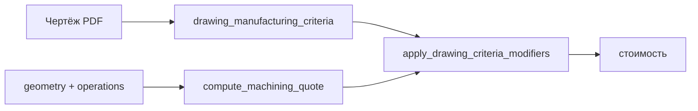
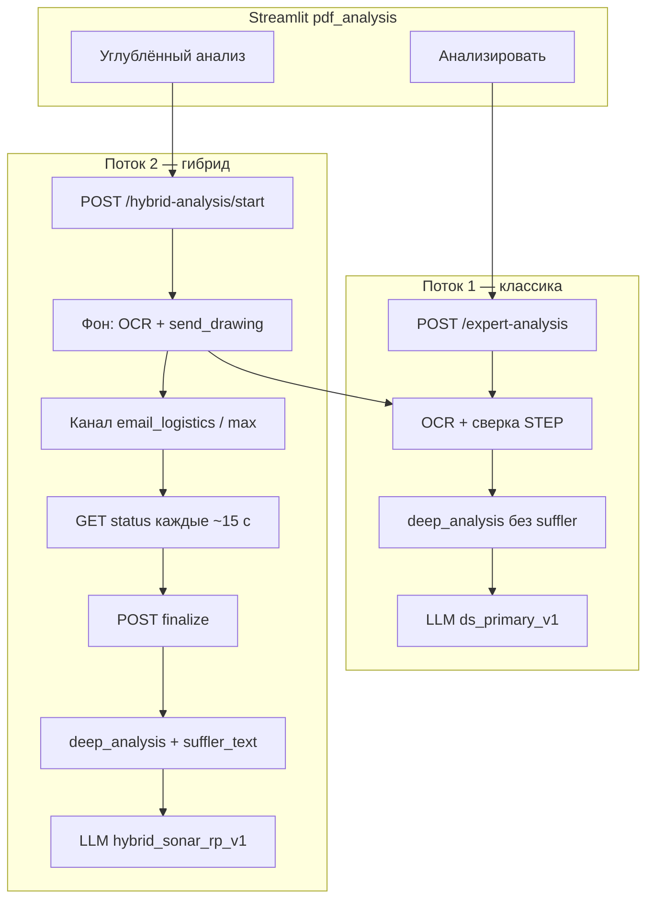

# Sinlex

Веб-приложение расчёта стоимости обработки по STEP и чертежу (Streamlit + FastAPI).

## Конфигурация

| Файл | Назначение |
|------|------------|
| `.env` | Публичные URL, ЮKassa (шаблон: `.env.example`) |
| `secrets.env` | API-ключи и флаги гибридного анализа (шаблон: `secrets.env.example`) |

Переменная `SINLEX_SECRETS_FILE` указывает альтернативный путь к `secrets.env`.

## Анализ STEP: критерии и геометрия

Модуль `extraction_tool` (`extractor.py`, `config.py`) и обёртка `step_analyzer.analyze_step()` формируют метрики для UI, калькулятора и сверки с чертежом. Результат сохраняется в `data.txt` проекта (`project_store.persist_step_analysis`).

### Пайплайн

| Режим | Условие | Особенности |
|-------|---------|-------------|
| **Полный** | STEP < 512 KiB | Ray-casting стенок, рёбра (если не `skip_edges`) |
| **Fast** | STEP ≥ 512 KiB | Упрощённые рёбра/полости; стенки — по вероятностному гейту (см. ниже) |
| **Литьё** | `POST /analyze-step?casting=true` | Стенки **всегда**, бюджет времени 45 с (`force_wall_thickness`) |

Точка входа API: `POST /analyze-step` (`api/routers/cad.py`). Загрузка проекта: `page_modules/upload_step.py`.

### Семейство детали (`part_family`)

Порядок классификации (`_detect_part_family` → `_resolve_part_family`):

| Семейство | Код | Когда |
|-----------|-----|-------|
| Крыльчатка | `impeller` | Много TORUS/BSPL, сечение лопатки — сплайн; **не** затирается в `rod` при resolve |
| Пруток / вал | `rod` | Тело вращения, Ø ≤ 300 мм, токарный профиль; короткие диски |
| Плита / корпус | `plate` | Коробчатый AABB, преобладание PLANE |
| Крупногабарит | `oversize` | Габарит > 400 мм или масса > 100 кг |
| Гибрид | `hybrid_shaft` | Длинный вал с прямоугольным сечением + фрезерные карманы |

От семейства зависят `operations`, `workpiece`, токарный кейс (`rotation_profile`) и prior в гейте тонкостенности.

### Индексы сложности

| Метрика | Формула / смысл | Использование |
|---------|-----------------|---------------|
| `surface_to_volume_ratio` | площадь / объём | Сложность, **гейт тонкостенности**, съём в `machining_cost` |
| `detail_index` | площадь / объём^(2/3) | Сложность, гейт тонкостенности, `removal_rate` |
| `elongation_index` | max(AABB) / min(AABB) | Подсказки по габаритам |
| `complexity` | `высокая` / `средняя` / `низкая` | sa/v, число граней, `detail_index`, гибрид |

### Тонкостенность: когда запускать ray-casting

В fast-режиме тяжёлый OCC-анализ стенок **не всегда** включается. Сначала считается вероятность `wall_thickness_run_probability` ∈ [0, 1] (`_wall_thickness_run_probability`):

**Сигналы (взвешенное среднее сигмоид по непрерывным признакам):**

| Вес | Признак |
|-----|---------|
| 42% | `surface_to_volume_ratio` (центр сигмоиды 0.22) |
| 22% | `detail_index` (центр 14) |
| 16% | доля freeform-граней (TORUS + BSPL) |
| 20% | prior по семейству (`impeller` 0.95, `plate` 0.82, `rod` 0.55, …) |

**Повышение:** тонкий диск (`is_disc`) при sa/v ≥ 0.45 → blend ≥ 0.72.

**Понижение (×штраф):**

- `oversize` → p = 0 (анализ не нужен);
- вытянутый вал + sa/v < 0.25 → ×0.08;
- токарный пруток (L/D ≥ 1.8, `rotation_confidence` ≥ 0.6, sa/v < 0.28) → ×0.12;
- гибридный вал + sa/v < 0.20 → доп. гашение.

**Решение:** при p ≥ `WALL_THICKNESS_RUN_THRESHOLD` (по умолчанию **0.45**, env `SINLEX_WALL_RUN_THRESHOLD`) вызывается `_analyze_wall_thickness`. Иначе в `data.txt`: `fast_skip (p=…)`. Поле `extraction.wall_thickness_run_probability` — для отладки.

Примеры: корпус-диск sa/v ≈ 0.9 → p ≈ 0.75, стенки считаются; вал намотки `oversize` → p = 0, пропуск; колесо компрессора `impeller` → p ≈ 0.8.

### Тонкостенность: как определяется признак `thin_walls`

Алгоритм (`_analyze_wall_thickness`): луч вдоль внутренней нормали грани, толщина — сегмент внутри тела (OCC `IntCurvesFace` + `BRepClass3d`).

| Параметр | Значение |
|----------|----------|
| Порог толщины | `max(2.0 мм, 2.5% диагонали bbox)` |
| Отчётная толщина | 10-й перцентиль выборки (не абсолютный min) |
| `thin_walls = true` | ≥ 15% точек ниже порога **и** медиана < 85% порога |

Влияние на расчёт: `thin_walls` снижает `removal_rate` (−15%) и увеличивает наладку в `machining_cost.py`.

### Ø прутка для дисков

Для дисков с фасонным контуром (много PLANE, мало наружных цилиндров) Ø берётся по **огибающей AABB**, а не по max внутреннему цилиндру (`DISC_MIN_OUTER_CYL_TO_BBOX_RATIO = 0.75`, `_rod_dims_from_bbox`). См. `tests/test_disc_rod_diameter.py`.

### Переменные окружения (STEP)

| Переменная | По умолчанию | Описание |
|------------|--------------|----------|
| `SINLEX_WALL_RUN_THRESHOLD` | `0.45` | Порог p для ray-casting в fast |
| `SINLEX_CASTING_WALL_BUDGET_SEC` | `45` | Бюджет стенок для литья |
| `SINLEX_CASTING_WALL_MAX_FACES` | `55` | Лимит граней при литье |

Подробнее о токарной классификации: [`docs/TZ-turning-rotation-classification.md`](docs/TZ-turning-rotation-classification.md).

---

## Критерии чертежа → стоимость

После анализа PDF детерминированный парсер (`drawing_analysis/manufacturing_criteria`) извлекает **критерии обработки** из текста чертежа (Ra, допуски отверстий, резьба, шпоночные пазы и т.д.). Они **не** подменяют геометрию STEP, а модифицируют базовый расчёт `machining_cost.compute_machining_quote()`.

| Источник | Приоритет | Примеры критериев |
|----------|-----------|-------------------|
| STEP (`extraction_tool`) | База: объём, процессы, установы, `thin_walls` | Токарная, фрезерная, съём |
| Чертёж (после «Анализировать») | Модификаторы времени/наладки/УП | `ra_finish_16`, `hole_tolerance`, `threaded_hole`, `keyway` |
| Углублённый канал (`suffler_text`) | Только в промпт LLM, **не** в ₽ напрямую | — |

Критерии привязаны к hash PDF: при смене файла без повторного анализа сбрасываются (`resolve_drawing_criteria_for_costing`). При конфликте одного критерия побеждает запись с `source="suffler"` (гибрид).

Каталог критериев v1 и коэффициенты: [`docs/TZ-costing-drawing-criteria.md`](docs/TZ-costing-drawing-criteria.md).

---

## Экспертный анализ: два потока и архитектура

В Sinlex «экспертный анализ» — это **два независимых пользовательских потока** с общей инфраструктурой OCR/STEP, но разной глубиной и разными стеками LLM. В перспективе потоки планируется **развести по тарифам** (классика — базовый план, углублённый — расширенный); сейчас оба доступны по флагу `ENABLE_HYBRID_SUFFLER` для углублённого режима.

| Поток | Кнопка в UI | API | Модуль | Внешний канал | LLM-стек |
|-------|-------------|-----|--------|---------------|----------|
| **1. Классический** | «Анализировать» | `POST /expert-analysis` | `expert_analyzer.deep_analysis` без `suffler_text` | нет | DeepSeek → Perplexity `sonar` |
| **2. Углублённый (гибрид)** | «Углублённый анализ» | `POST /hybrid-analysis/*` | `hybrid_analysis` → канал → `deep_analysis` с `suffler_text` | email / Max (legacy) | Perplexity `sonar-reasoning-pro` → DeepSeek |

Поток 1 **не блокируется** и **не меняется** при включении потока 2. Session keys гибрида с префиксом `hybrid_*` отделены от классического анализа.

### Схема потоков

### Поток 1 — «Анализировать»

1. Пользователь загружает PDF чертежа (после STEP).
2. `POST /expert-analysis` передаёт PDF и `step_data` (геометрия, материал, проект).
3. `deep_analysis()`:
   - при необходимости запускает **автоматическое распознавание** (`drawing_analysis`: OCR, layout, поля);
   - строит **детерминированную сверку** чертёж ↔ STEP (`compare_drawing_to_step`);
   - формирует промпт с геометрией STEP, сверкой и критериями для калькулятора;
   - вызывает LLM через `_call_llm_with_fallback(primary=deepseek)`.
4. Результат кэшируется в `{project}/analysis_cache/` (суффикс `draw_v*_*_ds_primary_v1`).
5. В UI — текст с маркером **Sinlex AI 1.0/1.2** (по фактическому провайдеру ответа).

Дополнительно из того же блока: **техкарта** (`POST /tech-card`) и **краткое резюме STEP** (`POST /manufacturing-brief`) используют **тот же классический стек** LLM.

### Поток 2 — «Углублённый анализ»

Асинхронный job (не держит worker FastAPI на время ожидания человека/канала):

1. `start` — создаётся `hybrid_jobs/{task_id}.json` (`status: pending`), в фоне (`BackgroundTasks`) — OCR/сверка и **отправка PDF во внешний канал**.
2. UI опрашивает `GET /hybrid-analysis/status/{task_id}` (`SUFFLER_POLL_INTERVAL_SEC`, по умолчанию 15 с).
3. Канал возвращает **текст углублённого распознавания** (`suffler_text`) → job переходит в `ready`.
4. `finalize` вызывает `deep_analysis(..., suffler_text=..., hybrid_task_id=...)` — в промпт попадает блок «ДАННЫЕ УГЛУБЛЁННОГО РАСПОЗНАВАНИЯ (приоритет 1)»; LLM с `primary=perplexity`, `sonar-reasoning-pro`, до 8000 токенов ответа.
5. Итог сохраняется в session (`hybrid_result_*`), кэш с суффиксом `hybrid_{hash}`.

Повторный запуск **в том же проекте** отменяет предыдущий `pending` (`cancelled` / `superseded`). Разные проекты и пользователи (`user_folder`) — **параллельные** job и письма; маршрутизация только по `task_id` / `Message-ID`.

Спецификации: [`docs/TZ-hybrid-deep-analysis.md`](docs/TZ-hybrid-deep-analysis.md), [`docs/TZ-hybrid-email-logistics.md`](docs/TZ-hybrid-email-logistics.md).

### Распознавание чертежа (общее для обоих потоков)

| Этап | Модуль | Назначение |
|------|--------|------------|
| Извлечение текста | `drawing_analysis.reader` | PDF → текст по страницам (`tesseract` / опционально `paddle`, `easyocr`) |
| Layout | `drawing_analysis` | Зоны: штамп, размеры, примечания (`tesseract_data` / layout) |
| Поля | `fields` в extraction | Обозначение, материал, шероховатости, примечания (с пометкой «неразборчиво» при сбое) |
| Сверка STEP | `drawing_analysis.compare` | Детерминированное сравнение Ø, отверстий, семейства детали; в LLM уходит как **приоритет над догадками** |
| Углублённый текст | внешний канал → `suffler_text` | Только поток 2; в промпте **приоритет 1** над OCR |

OCR не сохраняет растр — только текст и hash PDF. Подробнее: [`docs/drawing-ocr.md`](docs/drawing-ocr.md), [`docs/TZ-drawing-analysis.md`](docs/TZ-drawing-analysis.md).

В промпте LLM явно запрещено упоминать источник данных, качество OCR и «второй поток» — клиент видит единый «Углублённый анализ».

### Приватность и формулировки в UI

**Принцип:** пользователь работает только с брендом **Sinlex AI**; внутренняя архитектура (LLM, email, технолог, бот) не раскрывается.

| Допустимо в UI | Запрещено (примеры) |
|----------------|---------------------|
| «Анализировать», «Углублённый анализ», «Углублённый режим» | `email`, `SMTP`, `IMAP`, `Max`, названия провайдеров и моделей |
| «Выполняется углублённый анализ…», «Сервер анализа временно недоступен» | «суфлер», `suffler`, «эксперт», «технолог», «помощник», «внешний канал» |
| Маркеры **🔵 Sinlex AI 1.0** / **⚫ Sinlex AI 1.2** | `DeepSeek`, `Perplexity`, `sonar`, `API`, «второй этап», «ждём ответ по почте» |

Реализация:

- префиксы ответа — `expert_analyzer.format_llm_analysis_prefix` (по `api_used`, не по кнопке);
- сообщения ошибок канала — `HybridChannelError` / `MaxSufflerError` с нейтральным `ui_message`; юнит-тест `_assert_ui_safe` проверяет отсутствие запрещённых слов (`max_suffler._FORBIDDEN_UI_WORDS`);
- таймаут канала («Углублённый анализ ещё выполняется») **отделён** от отказа LLM (`LLM_UI_ERROR_MESSAGE`);
- в теле исходящего письма и служебных маркерах (`#sinlex-hybrid`, `task_id:`) — только для канала; **в Streamlit эти строки не показываются**.

Логи сервера (`api_used`, `task_id`, SMTP/IMAP) — только на бэкенде, не в ответах API для UI.

### Резервирование каналов LLM

Единая точка входа: `expert_analyzer._call_llm_with_fallback`.

| `primary` | Сценарий | Порядок | Суффикс кэша |
|-----------|----------|---------|--------------|
| `deepseek` | Поток 1, техкарта, manufacturing-brief | DeepSeek → при сбое Perplexity (`sonar`) | `ds_primary_v1` |
| `perplexity` | Поток 2 после `suffler_text` | Perplexity (`sonar-reasoning-pro`) → при сбое DeepSeek | `hybrid_sonar_rp_v1` |

При успехе резерва маркер в UI соответствует **фактическому** провайдеру (углублённый анализ при fallback на DeepSeek покажет 🔵 1.0, не ⚫ 1.2). Оба провайдера недоступны → `LLM_UI_ERROR_MESSAGE` без деталей API.

Ключи: `SINLEX_DS_API_KEY`, `SINLEX_PPLX_API_KEY` в `secrets.env`. Спецификация LP: [`docs/ТЗ-смена-приоритета-LLM.md`](docs/ТЗ-смена-приоритета-LLM.md).

### Обработчик email (`email_logistics`)

Активный канал задаётся в [`config/hybrid_channel.json`](config/hybrid_channel.json) (`active_channel: email_logistics`). Фасад: `get_hybrid_channel()` → `EmailLogisticsChannel`.

**Исходящее (SMTP):**

- PDF на `SUFFLER_EMAIL_TO` (ящик технологов), от `SUFFLER_EMAIL_FROM`;
- тема: `[Sinlex] Углублённый анализ — {project_name}`;
- тело: маркеры `#sinlex-hybrid`, `task_id`, `user_folder`, `project` + просьба ответить **Reply** в цепочке;
- уникальный `Message-ID` → запись в `data/email_logistics_state.json` → `pending[task_id]`.

На VPS mail.ru часто блокирует порты **587/465**; рабочий вариант — **SMTP 2525** (STARTTLS), см. `secrets.env.example`.

**Входящее (IMAP):**

- при `check_response(task_id)` — опрос `UNSEEN` в `SUFFLER_IMAP_FOLDER`;
- сопоставление ответа (без эвристики «последний pending»):
  1. `In-Reply-To` / `References` → сохранённый `Message-ID`;
  2. `task_id:{uuid}` или маркеры в теле;
- текст → `responses[task_id]`, письмо помечается прочитанным; job в Sinlex обновляется через `refresh_job_status`.

**Состояние:** один файл `email_logistics_state.json` на всех клиентов; изоляция задач — по UUID `task_id` и job-файлам `{user_folder}/{project}/hybrid_jobs/`. Legacy-канал Max (`max_suffler`) переключается тем же JSON; в UI поведение идентично.

## Углублённый анализ: переменные окружения

Поток 2 (кнопка **«Углублённый анализ»**) — см. [архитектуру](#экспертный-анализ-два-потока-и-архитектура). Спецификация: [`docs/TZ-hybrid-deep-analysis.md`](docs/TZ-hybrid-deep-analysis.md).

| Переменная | По умолчанию | Описание |
|------------|--------------|----------|
| `ENABLE_HYBRID_SUFFLER` | `0` | `1` — кнопка «Углублённый анализ» |
| `HYBRID_CHANNEL_CONFIG` | `config/hybrid_channel.json` | Канал: `email_logistics` или `max_suffler` |
| `SUFFLER_EMAIL_*`, `SUFFLER_IMAP_*` | — | SMTP/IMAP при email (см. TZ) |
| `MAX_SUFFLER_TOKEN`, `MAX_SUFFLER_CHAT_ID` | — | Legacy Max |
| `SUFFLER_TIMEOUT_SECONDS` | `3600` | Таймаут ожидания ответа канала, сек |
| `SUFFLER_POLL_INTERVAL_SEC` | `15` | Интервал опроса статуса в UI, сек |
| `HYBRID_JOB_DIR` | `{project}/hybrid_jobs` | Каталог JSON job-файлов (опционально) |

Канал ответа (Max / email): переключатель в [`config/hybrid_channel.json`](config/hybrid_channel.json) — см. [`docs/TZ-hybrid-email-logistics.md`](docs/TZ-hybrid-email-logistics.md). Целевой транспорт: **email_logistics**; Max — legacy.

На DEV перед включением UI: скопировать блок из `secrets.env.example` в `secrets.env`; для email — SMTP/IMAP; для Max — `MAX_SUFFLER_TOKEN`. На первых выкладках держать `ENABLE_HYBRID_SUFFLER=0` до smoke.

**Не коммитить** значения `MAX_SUFFLER_TOKEN` и других секретов.

## LLM: краткая справка

Подробности — в разделе [Экспертный анализ](#экспертный-анализ-два-потока-и-архитектура) (стеки, приватность, резерв).

| Маркер | Sinlex AI | Провайдер ответа |
|--------|-----------|------------------|
| 🔵 | 1.0 | DeepSeek |
| ⚫ | 1.2 | Perplexity |

Кэш: `{project}/analysis_cache/` (`draw_v*_*`, `manufacturing_brief_*_ds_primary_v1.json`). Секреты: `SINLEX_PPLX_API_KEY`, `SINLEX_DS_API_KEY`.

## OCR чертежей

См. [`docs/drawing-ocr.md`](docs/drawing-ocr.md) (`SINLEX_DRAWING_ENABLE_PADDLE`, `SINLEX_DRAWING_OCR_ENGINE`, …).

## Технические задания

| Документ | Тема |
|----------|------|
| [`docs/TZ-hybrid-deep-analysis.md`](docs/TZ-hybrid-deep-analysis.md) | Гибрид: HS-0…HS-8 |
| [`docs/TZ-hybrid-email-logistics.md`](docs/TZ-hybrid-email-logistics.md) | Канал email + JSON-переключатель (HE-0…HE-6) |
| [`docs/TZ-drawing-analysis.md`](docs/TZ-drawing-analysis.md) | OCR, layout, сверка STEP |
| [`docs/TZ-costing-drawing-criteria.md`](docs/TZ-costing-drawing-criteria.md) | Критерии → стоимость |
| [`docs/TZ-step-upload-limits.md`](docs/TZ-step-upload-limits.md) | Лимиты загрузки STEP |
| [`docs/TZ-turning-rotation-classification.md`](docs/TZ-turning-rotation-classification.md) | Токарка, `part_family`, вращение |
| [`docs/ТЗ-смена-приоритета-LLM.md`](docs/ТЗ-смена-приоритета-LLM.md) | LLM: два стека, маркеры Sinlex AI 1.0/1.2, LP-0…LP-6 |

## Этапы гибрида (кратко)

`HS-0` (документация, env) → `HS-1` (`max_suffler.py`) → `HS-2` (API job) → `HS-3` (UI) → `HS-4`…`HS-7` (анализ, критерии, v5) → `HS-8` (деплой).

### API гибрида (HS-2)

| Метод | Путь |
|-------|------|
| `POST` | `/hybrid-analysis/start` — PDF + `step_data` (form), ответ `{task_id, status}` |
| `GET` | `/hybrid-analysis/status/{task_id}?project_name=…` |
| `POST` | `/hybrid-analysis/finalize/{task_id}` — `project_name`, `step_data` (form) |
