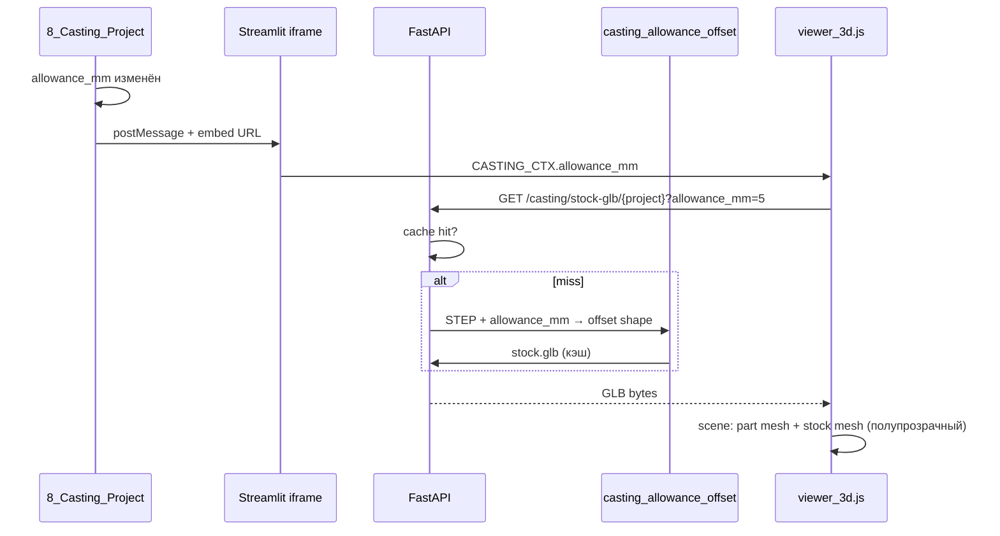

# ТЗ: припуск в 3D-viewer литья — геометрический offset (вариант A, OCC)

Версия: **2026-06-05**  
Статус: **внедрено (2026-06-05)**  
Связанные документы: `TZ-casting-module.md`, `TZ-casting-3d-viewer.md`  
Связанный код:
- `page_modules/viewer_3d.py` — embed viewer, overlay «Припуск» / «Усадка»
- `page_modules/8_Casting_Project.py` — параметры литья, `casting_ctx`, `broadcast_casting_ctx_to_viewer`
- `page_modules/5_Upload.py` — **3D-проекты** (`mode="default"`, не менять поведение)
- `casting_cost.py` — `stock_dims_mm()`, расчёт габаритов заготовки
- `api/services/step_convert.py` — STEP → GLB (trimesh)
- `api/services/casting_fs.py` — `ensure_casting_glb`
- `api/routers/casting.py`, `api/routers/embed.py`
- `extraction_tool/extractor.py` — OCC pipeline (чтение STEP)

Тестовые данные: `casting/sinlex_admin/FRM.698-00A_Корзина_для_Р-4.STEP` (отверстия 2×4, припуск 5 мм)

---

## 1. Цель

Заменить **визуализацию припуска** в литьевом 3D-viewer с ошибочного **масштабирования клона модели** на **геометрически корректный offset** по STEP на сервере (вариант A):

- внешние поверхности — **наружу** на `allowance_mm`;
- отверстия — **уменьшаются** (внутренние грани offset внутрь);
- толщина стенок — **увеличивается**;
- габариты — согласованы с логикой `stock_dims_mm()` в `casting_cost.py`.

**Критическое ограничение:** рабочая логика viewer в **3D-проектах** (`5_Upload.py`, `embed/3d-viewer`, `mode="default"`) **не изменяется**. Все доработки — только за ветками `mode == "casting"` / `isCastingView` / API `casting/`.

---

## 2. Проблема (as-is)

### 2.1. Текущая реализация

В `viewer_3d.py` → `build_three_viewer_html()` → `rebuildStockShell()`:

```javascript
stockGroup = model.clone(true);
var sf = allowanceScaleFactors(allowance);  // 1 + (2*a)/dim_x|y|z
stockGroup.scale.set(sf.x, sf.y, sf.z);
```

Коэффициенты берутся из `CASTING_CTX.dim_x/y/z` (мм, OCC) и применяются к осям mesh в Three.js (GLB, метры, другая ориентация).

### 2.2. Симптомы (подтверждено на Корзине)

| Симптом | Причина |
|---------|---------|
| Модель «вытягивается» по одной оси при росте припуска | Неравномерный `scale` по `dim_x ≠ dim_y ≠ dim_z` на осях GLB |
| Отверстия **увеличиваются** при припуске | Uniform scale увеличивает и внешний контур, и отверстия |
| Подпись «оболочка по форме детали» вводит в заблуждение | Это не offset, а масштабирование |

### 2.3. Расхождение с ТЗ 3D-viewer

В `TZ-casting-3d-viewer.md` §7 указано «offset вдоль нормалей» — **фактически не реализовано**. Настоящее ТЗ закрывает этот пробел.

### 2.4. Расчёт vs визуализация

`casting_cost.py` → `stock_dims_mm()`:

```python
add = 2.0 * allowance_mm
return x * shrink_scale + add, y * shrink_scale + add, z * shrink_scale + add
```

Расчёт габаритов заготовки — **линейное увеличение на 2N по осям bbox**. Визуализация должна быть **согласована по смыслу** (offset поверхности), а не противоречить (scale отверстий).

---

## 3. Целевое поведение (to-be)

### 3.1. Технологический смысл припуска

**Припуск на сторону N мм** — запас металла на механическую обработку **с готовой детали**. Отливка/заготовка **крупнее** финала:

| Геометрия | Готовая деталь (STEP) | Заготовка (+N мм/стор.) |
|-----------|----------------------|-------------------------|
| Внешний контур | исходный | offset **наружу** на N |
| Внутренние отверстия | диаметр D | диаметр **≈ D − 2N** |
| Толщина стенки | t | **≈ t + N** с каждой обрабатываемой стороны |
| Габариты bbox | L×W×H | **≈ (L+2N)×(W+2N)×(H+2N)** (с учётом усадки отдельно) |

### 3.2. Визуализация в viewer

- **Деталь** — существующий GLB (готовая геометрия), цвет `CASTING_PART_COLOR`.
- **Заготовка (припуск)** — отдельный GLB `stock`, полупрозрачный бирюзовый (`stockShellMat`), toggle «Припуск».
- **Усадка** — без изменений: uniform `scale` **только** на mesh детали (`shrink_pct`), не на stock GLB в MVP.
- Подпись overlay: `Припуск: +N мм/стор. (offset по STEP)`.

### 3.3. Что не делает припуск в viewer

- Не масштабирует деталь.
- Не меняет STEP/GLB детали при переключении toggle.
- Не влияет на 3D-проекты.

---

## 4. Область работ

### 4.1. В scope

1. Серверный модуль OCC: STEP shape → offset solid на `allowance_mm` → GLB заготовки.
2. Кэш GLB заготовки в папке литьевого проекта (ключ: `allowance_mm`, версия алгоритма).
3. API: отдача stock-GLB для viewer (новый маршрут или query-параметр).
4. Viewer (только `isCastingView`): загрузка второго GLB, отображение вместо `model.clone().scale()`.
5. Инвалидация/пересборка stock-GLB при смене `allowance_mm` в UI (debounce или по запросу viewer).
6. Удаление `allowanceScaleFactors()` и `rebuildStockShell()` на базе scale.
7. Обновление `TZ-casting-3d-viewer.md` §7 (статус, ссылка на настоящее ТЗ).
8. Smoke-тест **регрессии** `5_Upload.py` / `embed/3d-viewer`.

### 4.2. Вне scope

- Offset **усадки** в 3D (усадка остаётся scale на детали, как сейчас).
- Пересчёт массы/стоимости по объёму offset-меша (остаётся формула `casting_cost.py`).
- Heatmap толщины стенок.
- Offset в браузере (вариант B) — отклонён.
- Изменение pipeline STEP→GLB для **projects/**.
- Авто-offset при каждом движении слайдера без debounce (допустим debounce 0.5–1 с или генерация по стабилизации значения).

---

## 5. Архитектура (вариант A)

### 5.1. Новые модули

| Файл | Назначение |
|------|------------|
| `casting_allowance_offset.py` | OCC: загрузка shape, `MakeThickSolid` / `MakeOffsetShape`, экспорт mesh |
| `casting_stock_glb.py` | Оркестрация: путь кэша, вызов offset, trimesh/OCC → GLB |
| `api/routers/casting.py` | `GET /casting/stock-glb/{project}?allowance_mm=N` |

Расширение существующих (без ломания projects):

| Файл | Изменение |
|------|-----------|
| `api/services/casting_fs.py` | `ensure_casting_stock_glb(..., allowance_mm)` |
| `viewer_3d.py` | Ветка `isCastingView`: fetch stock GLB, убрать scale-clone |
| `embed.py` | Проброс `allowance_mm` в HTML/URL stock (если нужно) |
| `8_Casting_Project.py` | Триггер пересборки stock при смене припуска (опционально prefetch) |

### 5.2. Поток данных



### 5.3. Файлы в проекте литья

```text
casting/<user>/<project>/
  FRM....STEP          # исходный STEP (как сейчас)
  FRM.....glb          # деталь (как сейчас)
  FRM.....stock_5.0.glb   # заготовка, allowance=5.0 мм (новый)
  stock_meta.json      # опционально: allowance, algo_version, mtime
```

Имя кэша: `{safe_name}.stock_{allowance_q}.glb`, где `allowance_q` — `5.0`, `2.5` (один знак после запятой, как в UI).

Инвалидация: при смене `allowance_mm` — новый файл; при смене STEP — удалить все `*.stock_*.glb`.

---

## 6. OCC: алгоритм offset

### 6.1. Предпочтительный API

**OpenCASCADE** (уже в `extraction_tool` / `step_convert` OCC-ветка):

1. `STEPControl_Reader` → `TopoDS_Solid` (или shell → solid).
2. **`BRepOffsetAPI_MakeThickSolid`** или **`BRepOffsetAPI_MakeOffsetShape`**:
   - положительный offset **наружу** на `allowance_mm` (в мм; OCC работает в мм если STEP в мм — проверить единицы на Корзине);
   - режим: thickening outward от исходной поверхности.
3. Триангуляция: `BRepMesh_IncrementalMesh` → экспорт в GLB (через trimesh из вершин/граней или промежуточный STL).

### 6.2. Fallback при ошибке OCC

| Уровень | Поведение |
|---------|-----------|
| Offset не сошёлся (самопересечения) | `st.warning` / подпись в viewer: «Припуск: упрощённый bbox» + wireframe `stock_dims_mm` box |
| OCC недоступен | Не генерировать stock; toggle «Припуск» disabled + tooltip |
| allowance_mm = 0 | Stock не запрашивается, кнопка неактивна |

### 6.3. Единицы

- STEP/OCC анализ — **мм** (`dimensions` в `analysis.json`).
- GLB детали — **метры** (~0.55 для 550 мм) — **не использовать** для вычисления offset.
- Offset выполняется в **мм в OCC** до экспорта; stock GLB масштабируется так же, как part GLB (единицы согласованы при экспорте из одного STEP).

### 6.4. Версионирование алгоритма

Константа `STOCK_OFFSET_ALGO_VERSION = 3` в `stock_meta.json` (v2: `fix_normals` при финализации; v3: ориентация граней OCC + multi-pass mesh). При смене алгоритма — сброс кэша всех `*.stock_*.glb`.

---

## 7. Изменения viewer (только литьё)

### 7.1. Изоляция от 3D-проектов

| Механизм | 3D-проекты | Литьё |
|----------|------------|-------|
| `render_3d_viewer(..., mode=)` | `"default"` | `"casting"` |
| Embed path | `3d-viewer` | `3d-casting` |
| `CASTING_CTX.enabled` | `false` | `true` |
| JS `isCastingView` | `false` | `true` |
| Stock GLB / offset | **не вызывается** | загрузка stock |
| `allowanceScaleFactors` | код не выполняется | **удалить** |

**Правило:** любой новый код в `build_three_viewer_html()` — только внутри блоков `if (isCastingView) { ... }`. Не менять ветки загрузки GLB, материалов, камеры, wireframe для `!isCastingView`.

### 7.2. Загрузка stock GLB в JS

1. После загрузки part GLB — асинхронный `fetch` stock URL:
   ```text
   /api/casting/stock-glb/{project}?key=...&email=...&folder=...&allowance_mm=5.0
   ```
2. Парсинг через тот же `GLTFLoader`.
3. `stockGroup` — отдельный `gltf.scene`, материал `stockShellMat`, `renderOrder = -1`.
4. `rebuildStockShell()` → `loadStockGlb()` + `disposeStockGroup()`.
5. При `postMessage` смены `allowance_mm` — перезагрузка stock (с spinner «Припуск…»).

### 7.3. Удаляемый код

- `allowanceScaleFactors()`
- `model.clone(true)` + `stockGroup.scale.set(...)` в `rebuildStockShell`

### 7.4. Подпись overlay

Было: `Припуск: +N мм/стор. (оболочка по форме детали)`  
Стало: `Припуск: +N мм/стор. (заготовка, offset STEP)`

---

## 8. API

### 8.1. Новый маршрут

```http
GET /api/casting/stock-glb/{project_name}
    ?key=...
    &email=...
    &folder=...
    &allowance_mm=5.0
```

**Ответ:** `application/gltf-binary` (GLB), 404 если STEP нет, 422 если `allowance_mm <= 0`.

**Логика:**
1. Auth как у `GET /casting/glb/...`.
2. `ensure_casting_stock_glb(project, allowance_mm)` — кэш или генерация.
3. `FileResponse` / streaming bytes.

### 8.2. Без изменений

- `GET /api/projects/glb/...` — **без изменений**
- `GET /api/embed/3d-viewer/...` — **без изменений**
- `POST /step-to-glb` — **без изменений**

---

## 9. UI / триггеры (8_Casting_Project.py)

1. При изменении `allowance_mm` в fragment параметров — `broadcast_casting_ctx_to_viewer` (как сейчас).
2. Viewer сам запрашивает stock GLB по новому `allowance_mm` (не блокировать UI Streamlit).
3. Опционально: prefetch stock при blur поля припуска (фоновый запрос API) — ускоряет toggle.

Параметры усадки **не** пересобирают stock GLB в MVP (усадка визуально на детали).

---

## 10. Требования по этапам

### Этап 1 — OCC offset + кэш GLB (сервер)

**Задачи:**
1. `casting_allowance_offset.py`: STEP → offset solid → mesh.
2. `casting_stock_glb.py`: путь `{name}.stock_{N}.glb`, meta, инвалидация при обновлении STEP.
3. `GET /casting/stock-glb/...`.
4. Unit/smoke: Корзина, allowance 2 / 5 / 10 мм — файлы создаются, GLB валиден.

**Критерии приёмки:**
- [ ] Stock GLB существует и больше part GLB по bbox (для 5 мм на Корзине).
- [ ] Повторный запрос — из кэша (< 100 ms без OCC).
- [ ] `projects/` и `ensure_glb_from_stp` не затронуты.

**Оценка:** 2–3 дня.

---

### Этап 2 — Viewer: второй mesh вместо scale

**Задачи:**
1. В `viewer_3d.py` (только `isCastingView`): fetch + отображение stock GLB.
2. Удалить `allowanceScaleFactors` / scale-clone.
3. Spinner при загрузке stock; fallback при 404/500.
4. Обновить подпись overlay.

**Критерии приёмки:**
- [ ] Корзина, припуск 5 мм: отверстия визуально **уже**, стенки **толще**, нет вытягивания по одной оси.
- [ ] Toggle «Припуск» вкл/выкл без перезагрузки part GLB.
- [ ] `5_Upload.py`: viewer без регрессий (smoke §11).
- [ ] `embed/3d-viewer` на 3D-проекте: нет запросов к `/casting/stock-glb`.

**Оценка:** 1.5–2 дня.

---

### Этап 3 — Fallback и полировка

**Задачи:**
1. Bbox fallback при сбое OCC (wireframe box по `stock_dims_mm`).
2. Удаление старых `*.stock_*.glb` при новой загрузке STEP.
3. Документация: обновить §7 в `TZ-casting-3d-viewer.md`.

**Критерии приёмки:**
- [ ] При намеренно битом STEP offset — part viewer работает, stock — fallback или warning.
- [ ] Нет мёртвого кода `allowanceScaleFactors`.

**Оценка:** 0.5–1 день.

---

## 11. Тест-план

| # | Сценарий | Ожидание |
|---|----------|----------|
| 1 | Корзина, припуск 0 | Stock не грузится, кнопка «Припуск» неактивна или пустая сцена |
| 2 | Корзина, припуск 2 → 5 → 10 | Stock перестраивается; отверстия монотонно уменьшаются |
| 3 | Сравнение с scale (до патча) | Нет «вытягивания» только по длинной оси |
| 4 | 3D-проект (не литьё) | Один GLB, нет stock, нет бирюзовой оболочки |
| 5 | `embed/3d-viewer` | HTTP 200, тот же HTML без stock-fetch |
| 6 | Смена STEP в литье | Старые `*.stock_*.glb` удалены |
| 7 | Кэш stock | Второй запрос с тем же N — быстрый ответ |
| 8 | Усадка + припуск вместе | Усадка scale на детали; stock — offset по исходному STEP (MVP) |

---

## 12. Риски и митигация

| Риск | Митигация |
|------|-----------|
| OCC offset падает на сложной геометрии | Fallback bbox; логирование; не ломать part viewer |
| Долгая генерация (10–30 с) | Кэш; spinner в viewer; опциональный prefetch |
| Единицы мм/м | Offset только в OCC из STEP; один pipeline экспорта GLB |
| Регрессия 3D-проектов | Жёсткая изоляция `isCastingView`; smoke в CI/ручной чеклист |
| Расхождение bbox stock и `stock_dims_mm` | Допустимо в MVP; в отчёте — bbox из расчёта, в 3D — точный offset |

---

## 13. Нефункциональные требования

- Генерация stock для Корзины (5 мм): **≤ 30 с** на VPS (cold OCC).
- Размер stock GLB: ориентир **≤ 2×** part GLB.
- Не блокировать Streamlit: генерация в FastAPI worker.
- Логи: `project`, `allowance_mm`, время OCC, без полного API key.

---

## 14. Порядок внедрения и оценка

```text
Этап 1 (OCC + API + кэш)
    → Этап 2 (viewer stock mesh, убрать scale)
    → Этап 3 (fallback + docs)
```

| Объём | Срок |
|-------|------|
| Полная реализация (этапы 1–3) | **4–6 дней** |

---

## 15. Статус внедрения

| Этап | Описание | Статус |
|------|----------|--------|
| 1 | OCC offset, stock GLB, API | Готово |
| 2 | Viewer: второй mesh, без scale | Готово |
| 3 | Fallback, инвалидация, docs | Готово |
| 4 | Патч §18: ориентация граней, algo v3 | Готово |

---

## 16. Связь с другими ТЗ

- **`TZ-casting-3d-viewer.md` §7:** после внедрения заменить формулировку «offset реализован» на ссылку к настоящему ТЗ; убрать описание scale-clone как финального решения.
- **`TZ-casting-module.md`:** визуализация припуска — уточнение scope (было «вне scope» подсветка стенок; припуск — в scope литья).
- **`TZ-casting-report-pdf.md`:** скриншот отчёта должен использовать stock offset (после этапа 2).

---

## 17. Критерий «не задеть 3D-проекты» (обязательный чеклист перед merge)

- [ ] `5_Upload.py`: вызов `render_3d_viewer(..., mode="default")` без новых параметров.
- [ ] `build_three_viewer_html()`: diff не меняет код вне `isCastingView` / `CASTING_CTX.enabled`.
- [ ] Нет новых импортов casting-модулей в `upload_step.py` / `projects_fs.py`.
- [ ] `GET /projects/glb/` — ответ байт-в-байт как до патча (тот же файл).
- [ ] Ручной smoke: открыть любой 3D-проект — модель, камера, wireframe без изменений.

---

## 18. Патч: ориентация граней stock GLB для режима «Отливка» (2026-06-06)

Связанный патч viewer: `TZ-casting-3d-viewer.md` §12.

### 18.1. Проблема

В режиме «Отливка» (solid stock в viewer) часть треугольников **не отображалась** — выглядело как прозрачные/отсутствующие грани. Причины:

1. Триангуляция OCC собиралась без учёта `Face.Orientation()` — на `TopAbs_REVERSED` winding был неверный.
2. Отдельные грани не получали triangulation (`triangulation is None`) и **пропускались** в mesh.
3. Клиентская эвристика «развернуть треугольник от центра bbox» ломала **вогнутые** участки (ложный flip).
4. `trimesh.fix_normals()` после экспорта мог перезаписать корректную ориентацию OCC.

### 18.2. Изменения сервера

**Файл:** `casting_allowance_offset.py`

| Функция | Изменение |
|---------|-----------|
| `_count_faces` | Подсчёт граней для контроля полноты mesh |
| `_mesh_shape` | Обёртка `BRepMesh_IncrementalMesh` |
| `_extract_shape_mesh` | `topods.Face()` + `face.Orientation() == TopAbs_REVERSED` → swap `n2`/`n3` в треугольнике |
| `shape_to_trimesh` | До **3 проходов** mesh с уменьшающимся `linear_deflection` / `angular_deflection`, пока `skipped == 0` или `skipped/total <= 1%`; warning в лог при остаточных пропусках |

**Файл:** `casting_stock_glb.py`

| Изменение | Детали |
|-----------|--------|
| `STOCK_OFFSET_ALGO_VERSION` | **3** — инвалидация кэша `*.stock_*.glb` |
| `_finalize_stock_mesh` | `merge_vertices`, `remove_degenerate_faces`, `remove_duplicate_faces`; **`fix_normals()` убран** — ориентация только из OCC |

### 18.3. Изменения viewer (только литьё)

**Файл:** `page_modules/viewer_3d.py`

- Режим «Отливка»: `castingSolidMat` — `MeshStandardMaterial`, `DoubleSide`.
- Удалена клиентская `fixStockMeshWinding()` (flip по центроиду).
- `prepareCastingSolidMesh()` — только `computeVertexNormals()` после загрузки stock.

Подробности UI и toggle — `TZ-casting-3d-viewer.md` §12.

### 18.4. Критерии приёмки

- [x] Stock GLB v3: нет пропущенных граней на тестовой Корзине (припуск 5 мм) в режиме «Отливка».
- [x] Solid stock с освещением (не `MeshBasicMaterial`).
- [x] Кэш v1/v2 пересобирается автоматически (`algo_version` в meta).
- [x] Fallback bbox без регрессий.

### 18.5. Тест

1. Проект **Корзина**, `allowance_mm = 5`.
2. Включить «Отливка» — сплошное бирюзовое тело, без дыр на вогнутых зонах.
3. Сменить припуск на `5.1` — новый stock GLB, визуально то же качество mesh.
4. `embed/3d-viewer` на 3D-проекте — без запросов stock-glb (регрессия).
