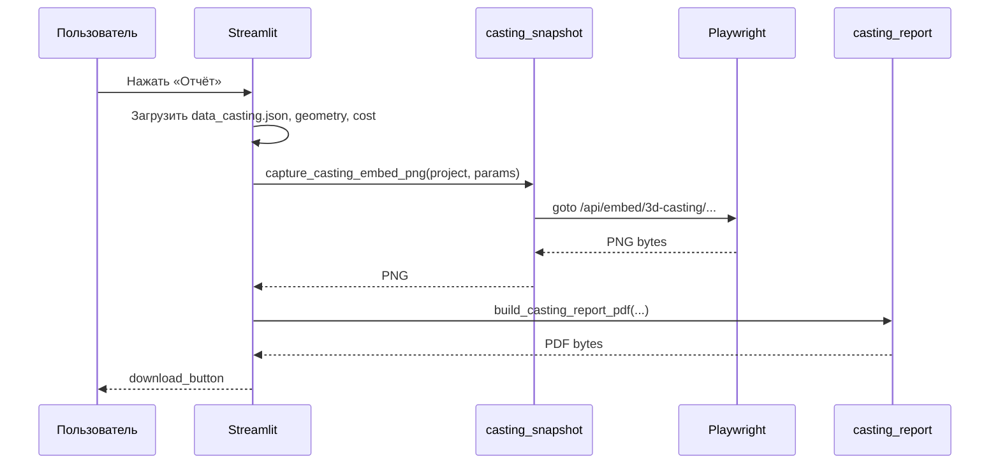

# ТЗ: кнопка «Отчёт» → PDF в модуле «Литьё»

Версия: **2026-06-05**  
Статус: **черновик (ожидает внедрения)**  
Связанные документы: `TZ-casting-module.md`, `TZ-casting-3d-viewer.md`  
Связанный код:
- `page_modules/8_Casting_Project.py` — страница проекта литья, блок ИИ-анализа
- `page_modules/viewer_3d.py` — embed URL viewer (`/api/embed/3d-casting/...`)
- `casting_analysis.py` — ИИ-анализ, `data_casting.json`
- `casting_cost.py` — расчёт стоимости
- `casting_io.py` — пути к файлам проекта
- `api/routers/embed.py` — HTML embed viewer
- `expert_analyzer.py` — `normalize_analysis_display()` (очистка markdown для UI)

Тестовые данные: `casting/sinlex_admin/FRM.698-00A_Корзина_для_Р-4.STEP`

---

## 1. Цель

После выполнения **ИИ-анализа** на странице литьевого проекта дать пользователю кнопку **«Отчёт»**, которая формирует и скачивает **PDF-документ**, содержащий:

1. **Скриншот 3D-модели** — визуализация детали в текущей конфигурации viewer (минимум: изометрия + припуск/усадка из параметров; целевой вариант: ракурс «как на экране»).
2. **Весь текст ИИ-анализа** с читаемым форматированием (заголовки, списки, таблицы, выделения).
3. **Сводные данные проекта**: геометрия STEP, параметры литья, стоимость, предупреждения по толщине стенки.

Отчёт предназначен для сохранения, печати и передачи коллегам/заказчику. Это **не** коммерческое ТКП и **не** замена КП из модуля 3D-проектов (кнопка «Скачать КП (PDF)» в `5_Upload.py` остаётся отдельной задачей).

---

## 2. Текущее состояние (as-is)

| Аспект | Реализация |
|--------|------------|
| ИИ-анализ | Кнопка «Запустить анализ» в `_casting_ai_section()` |
| Результат анализа | Markdown в `data_casting.json` → `analysis_text`; отображение через `st.info(normalize_analysis_display(...))` |
| Снимок параметров | `params`, `cost_snapshot` в том же `data_casting.json` |
| 3D viewer | `st.iframe` с URL `/api/embed/3d-casting/{project}?...` (см. `TZ-casting-3d-viewer.md` §5.4) |
| Состояние камеры / overlay | Только в JS внутри iframe (OrbitControls, «Припуск», «Усадка») |
| PDF в проекте | **Нет** готового движка; в `5_Upload.py` — заглушка «В разработке» |
| Python-зависимости | В env установлен **Pillow**; `reportlab` / `playwright` / `weasyprint` — **отсутствуют** |

**Ограничение:** Streamlit и Python-бэкенд **не имеют доступа** к canvas внутри cross-origin iframe. Скриншот «как пользователь видит сейчас» нельзя сделать одним вызовом из `8_Casting_Project.py` без доработки embed-страницы или server-side рендера.

---

## 3. Область работ

### 3.1. В scope

1. Кнопка **«Отчёт»** на странице литьевого проекта (рядом с «Запустить анализ» или под блоком результата).
2. Генерация **одного PDF-файла** по данным проекта.
3. Вставка **изображения 3D** (PNG) в PDF.
4. Форматированный вывод **полного текста** `analysis_text` (markdown → PDF).
5. Блоки: титул, геометрия, параметры литья, стоимость, предупреждения `wall_thickness_warning`.
6. `st.download_button` для скачивания без отдельной страницы.
7. Опционально: кэш PDF на диске в папке проекта.

### 3.2. Вне scope

- Редактирование отчёта в UI перед скачиванием.
- Отправка PDF по email / в мессенджеры.
- Электронная подпись, штампы, водяные знаки юрлица.
- Heatmap толщины стенок на скриншоте (см. отдельный эпик heatmap).
- Унификация с КП 3D-проектов (`5_Upload.py`).
- Автоматическая пересборка PDF при каждом изменении параметров (только по кнопке).

---

## 4. Источники данных для отчёта

| Блок PDF | Поле / функция | Файл |
|----------|----------------|------|
| Название проекта | `project_name` | сессия / URL |
| Пользователь / компания | `user_folder()`, `accounts.json` | auth |
| Дата отчёта | `datetime.now()` или `data_casting.updated_at` | — |
| ИИ-анализ | `analysis_text` | `casting/<folder>/<project>/data_casting.json` |
| Параметры литья | `params` (тип, материал, усадка, припуск, партия) | `data_casting.json` + `session_state` |
| Стоимость | `cost_snapshot` | `data_casting.json` + `compute_casting_cost()` |
| Геометрия STEP | `geometry`, `model_dimensions`, `data.txt` | `analysis.json`, `data.txt` |
| Предупреждение стенки | `wall_thickness_warning()` | `casting_cost.py` / UI |
| Скриншот 3D | PNG (см. §5) | генерируется при запросе |

**Условие активации кнопки «Отчёт»:**

- обязательно: загружен STEP, выполнен OCC-анализ, есть `analysis_text` (после хотя бы одного «Запустить анализ»);
- при отсутствии анализа — кнопка disabled или `st.warning` «Сначала запустите анализ».

При расхождении `session_state` и `data_casting.json` приоритет у **актуальных** `last_params` / `last_cost` из сессии для сводной таблицы; текст ИИ — из `analysis_text` (перезапуск анализа обновляет файл).

---

## 5. Скриншот 3D-модели

### 5.1. Проблема

Viewer отображается в `st.iframe` по адресу:

```text
https://sinlex.tech/api/embed/3d-casting/{project}?key=...&email=...&folder=...&height=520&casting=1&allowance_mm=...&shrink_pct=...&dim_x=...&dim_y=...&dim_z=...
```

Камера, зум, включение «Припуск» / «Усадка» / wireframe живут только в JavaScript embed-страницы. Python не может вызвать `canvas.toDataURL()` напрямую.

### 5.2. Варианты реализации

| Вариант | Описание | Соответствие «как сейчас» | Сложность |
|---------|----------|---------------------------|-----------|
| **A — Server render (MVP)** | Headless Chromium (Playwright) открывает embed URL с query-параметрами; фиксированный вид **«Изо»**; припуск/усадка из `params` | Частичное (не орбита пользователя) | Средняя |
| **B — Client capture** | В embed JS: по `postMessage` от Streamlit — `renderer.domElement.toDataURL()`, ответ в parent | Полное | Высокая |
| **C — Статичный GLB-рендер** | Серверный рендер mesh без Three.js UI | Нет overlay припуска | Высокая, отдельный пайплайн |

**Рекомендация:** внедрять **вариант A** в MVP; **вариант B** — этап 2.

### 5.3. Этап 1 (MVP): Playwright snapshot

**Новый модуль:** `api/services/casting_snapshot.py` (или `casting_snapshot.py` в корне).

**Алгоритм:**

1. Собрать URL embed (та же логика, что `viewer_embed_src()` — **обязательно** `api_browser_base()`, не `site_base_from_browser_api()`).
2. Query: `allowance_mm`, `shrink_pct`, `dim_x/y/z` из `casting_ctx`; опционально `camera=iso` (пресет кнопки «Изо» в viewer).
3. Playwright: `page.goto(url)`, дождаться исчезновения спиннера / события `viewer-ready` (добавить в embed JS).
4. `page.screenshot(type="png", clip=...)` области `#wrap` или всего viewport.
5. Вернуть `bytes` PNG в `build_casting_report_pdf()`.

**Подпись под изображением в PDF:**  
«Вид: изометрия. Припуск: X мм. Усадка: Y %. Сетка: да.»

### 5.4. Этап 2: снимок «как на экране»

**Изменения в embed JS** (`viewer_3d.py` → `build_three_viewer_html`):

1. Обработчик `window.addEventListener('message', ...)`: команда `{ type: 'sinlex-capture-viewer' }`.
2. Ответ: `{ type: 'sinlex-viewer-capture', png: '<base64>' }` с текущим состоянием камеры и overlay.
3. В Streamlit: `components.html` bridge или сохранение PNG в `session_state` перед генерацией PDF.

**Ограничения:** размер base64 (лимит postMessage / session_state); при ошибке — fallback на вариант A.

---

## 6. Генерация PDF

### 6.1. Стек (рекомендуемый)

| Компонент | Библиотека | Назначение |
|-----------|------------|------------|
| Вёрстка PDF | `reportlab` (platypus) | страницы, таблицы, изображения |
| Markdown → элементы | собственный парсер или `markdown` + конвертер | заголовки `##`, списки, `**жирный**`, таблицы `\|` |
| Изображение | `Pillow` (уже есть) | ресайз PNG под ширину страницы |
| Кириллица | TTF `DejaVuSans` / `Roboto` | регистрация шрифта в reportlab |

**Альтернатива:** `weasyprint` (HTML/CSS → PDF) — красивее для markdown, но тяжелее по зависимостям (cairo, pango) на VPS.

### 6.2. Структура документа (2–4 страницы)

```text
┌─────────────────────────────────────────┐
│  [логотип Sinlex]                       │
│  Отчёт по литьевому проекту             │
│  {project_name}                         │
│  Дата: DD.MM.YYYY                       │
│  Пользователь: {email / company}        │
├─────────────────────────────────────────┤
│  [PNG скриншот 3D, белый фон]           │
│  Подпись: габариты, вид, припуск        │
├─────────────────────────────────────────┤
│  Параметры литья (таблица)              │
│  Геометрия STEP (таблица)               │
│  Стоимость (таблица из cost_snapshot)   │
│  [warning] Мин. толщина стенки — если есть│
├─────────────────────────────────────────┤
│  ИИ-анализ Sinlex                       │
│  (секции 1–6 из analysis_text)          │
│  — заголовки, списки, таблицы           │
├─────────────────────────────────────────┤
│  Footer: Sinlex AI · не является ТКП    │
└─────────────────────────────────────────┘
```

### 6.3. Форматирование `analysis_text`

Типичная структура (пример — Корзина):

- Префикс `🔵 Sinlex AI 1.0` — в PDF как шапка секции (без emoji или заменить на текст).
- Заголовки `## N. ...` — стиль H2, отступ сверху.
- `**жирный**` — bold в reportlab.
- Маркированные списки `- ...` — bullet list.
- Таблицы markdown `| ... |` — `Table` в reportlab с чередованием фона строк.
- Перенос длинных абзацев — автоматический; разрыв страницы между крупными секциями.

Использовать `normalize_analysis_display()` / `strip_analysis_prefix_for_llm()` там, где нужна согласованность с UI, но **не** терять структуру markdown.

### 6.4. Имя файла

```text
Sinlex_Отчет_{sanitized_project_name}_{YYYYMMDD}.pdf
```

`sanitized_project_name` — без `/`, обрезка длины ≤ 80 символов.

---

## 7. Архитектура и файлы

### 7.1. Новые / изменяемые модули

| Файл | Назначение |
|------|------------|
| `casting_report.py` | `build_casting_report_pdf(...) -> bytes` — сборка PDF |
| `casting_snapshot.py` | `capture_casting_embed_png(...) -> bytes` — Playwright (этап 1) |
| `page_modules/8_Casting_Project.py` | Кнопка «Отчёт», spinner, `st.download_button` |
| `viewer_3d.py` | Этап 2: `postMessage` capture; этап 1: событие `viewer-ready` |
| `requirements.txt` / conda env | `reportlab`, `playwright` |

**Опционально (если snapshot через API):**

| Файл | Назначение |
|------|------------|
| `api/routers/casting.py` | `GET /casting/report/{project_name}.pdf` |

Для MVP достаточно генерации **внутри Streamlit** без отдельного API-эндпоинта.

### 7.2. Поток данных (MVP)



### 7.3. Кэширование (опционально)

Путь: `casting/<user_folder>/<project>/report_cache.pdf`  
Ключ инвалидации: hash(`analysis_text` + `params` + `cost_snapshot` + версия шаблона PDF).  
При совпадении — отдавать файл без Playwright (ускорение повторного скачивания).

---

## 8. UI / UX

### 8.1. Размещение

В `_casting_ai_section()` (`8_Casting_Project.py`):

```text
[ Запустить анализ ]     (существующая, бирюзовая)

— после появления analysis_text —

[ Отчёт ]                  (новая, secondary или outline)

[ блок st.info с текстом анализа ]
```

Либо две кнопки в одной строке: `st.columns([1, 1])`.

### 8.2. Поведение

1. Клик «Отчёт» → `st.spinner("Формирование PDF…")` (5–15 с при Playwright).
2. Успех → `st.download_button(label="Скачать отчёт.pdf", data=pdf_bytes, ...)`.
3. Ошибка snapshot → PDF **без** картинки + `st.warning` «Не удалось снять 3D; отчёт без изображения».
4. Ошибка PDF → `st.error` с кратким текстом.

### 8.3. Стили

Кнопка «Отчёт» — визуально вторичная относительно «Запустить анализ» (не конкурировать с бирюзовым CTA). Допустима иконка 📄 в label.

---

## 9. Зависимости и деплой

### 9.1. Python-пакеты

```text
reportlab>=4.0
playwright>=1.40        # только для этапа 1 (snapshot)
```

После установки на VPS:

```bash
playwright install chromium
playwright install-deps   # системные библиотеки для headless Chrome
```

### 9.2. Шрифты

Положить `DejaVuSans.ttf` (или аналог с кириллицей) в `static/fonts/` и регистрировать в `casting_report.py`. Без TTF кириллица в reportlab отобразится «квадратами».

### 9.3. Перезапуск сервисов

| Изменение | Сервис |
|-----------|--------|
| Только `8_Casting_Project.py`, `casting_report.py` | `sinlex-streamlit` |
| `embed.py`, `viewer_3d.py` (viewer-ready / capture) | `sinlex-streamlit` + `sinlex-server` |
| Новый API-роут | `sinlex-server` |

---

## 10. Нефункциональные требования

- **Время генерации:** MVP ≤ 20 с на проекте размером Корзины (Playwright cold start учтён).
- **Размер PDF:** ориентир ≤ 5 МБ (PNG width ~1200 px, JPEG fallback при превышении).
- **Блокировка UI:** только на время клика; не фоновая автогенерация.
- **Безопасность:** URL embed с `key=` — как в текущем viewer; не логировать полный URL с ключом.
- **Изоляция:** отчёт литья не меняет `5_Upload.py` и не требует STEP в `projects/`.
- **Дисклеймер:** футер PDF — «Справочный отчёт Sinlex AI, не является коммерческим предложением».

---

## 11. Требования по этапам

### Этап 1 — PDF без скриншота (быстрый smoke)

**Цель:** проверить вёрстку и markdown до подключения Playwright.

**Задачи:**

1. Создать `casting_report.py` с шрифтом кириллицы.
2. Секции: титул, параметры, геометрия, стоимость, ИИ-текст.
3. Кнопка «Отчёт» + download.

**Критерии приёмки:**

- [ ] PDF открывается, кириллица читаема.
- [ ] Таблица из §4 анализа (Корзина) отображается корректно.
- [ ] Плейсхолдер «Изображение 3D недоступно» на месте скриншота.

**Оценка:** 1–1.5 дня.

---

### Этап 2 — Скриншот embed (Playwright, вид «Изо»)

**Задачи:**

1. `casting_snapshot.py` + событие готовности viewer в embed JS.
2. Вставка PNG в PDF, подпись под изображением.
3. Query-параметры припуска/усадки совпадают с `params` на странице.

**Критерии приёмки:**

- [ ] На Корзине в PDF видна модель на белом фоне, сетка литья.
- [ ] При `allowance_mm=5` на скриншоте виден полупрозрачный припуск (если включён по умолчанию в embed).
- [ ] URL snapshot — `/api/embed/3d-casting/...`, не лендинг (см. `TZ-casting-3d-viewer.md` §11).

**Оценка:** 1–1.5 дня.

---

### Этап 3 — Полировка UX и кэш

**Задачи:**

1. Disabled-состояние кнопки без анализа.
2. Имя файла, footer, логотип Sinlex.
3. Опциональный кэш `report_cache.pdf`.
4. Fallback при ошибке Playwright.

**Критерии приёмки:**

- [ ] Повторное скачивание без смены данных — быстрее (если кэш включён).
- [ ] Понятные сообщения об ошибках в UI.

**Оценка:** 0.5 дня.

---

### Этап 4 (backlog) — Снимок «как на экране»

**Задачи:**

1. `postMessage` capture в embed JS.
2. Bridge Streamlit ↔ iframe.
3. Приоритет client-PNG над Playwright.

**Критерии приёмки:**

- [ ] Пользователь вращает модель, включает wireframe, жмёт «Отчёт» — PDF совпадает с экраном.

**Оценка:** 1–2 дня.

---

## 12. Тест-план

| # | Сценарий | Ожидание |
|---|----------|----------|
| 1 | Корзина, после ИИ-анализа → «Отчёт» | PDF скачивается, все 6 секций текста на месте |
| 2 | Проект без `analysis_text` | Кнопка неактивна или предупреждение |
| 3 | Смена припуска, без нового ИИ-анализа → «Отчёт» | Сводная таблица с новым припуском; текст ИИ — старый (ожидаемо) |
| 4 | Playwright недоступен / timeout | PDF без картинки + warning |
| 5 | Длинный анализ (2+ стр.) | Нет обрезания текста, корректные разрывы страниц |
| 6 | Таблица markdown в §4 | Колонки выровнены, числа с ₽ читаемы |
| 7 | `wall_thickness_warning` активен | Блок предупреждения в PDF |
| 8 | Embed URL | Не лендинг sinlex.tech (регрессия §11 3d-viewer ТЗ) |

---

## 13. Риски и митигация

| Риск | Вероятность | Митигация |
|------|-------------|-----------|
| Playwright / Chromium на VPS | Средняя | `install-deps`, документировать в README деплоя |
| Долгая генерация блокирует Streamlit | Средняя | spinner, кэш, уменьшение разрешения PNG |
| Таблицы markdown ломают вёрстку | Средняя | unit-тест на примере Корзины; fallback — monospace block |
| iframe ≠ экран пользователя (MVP) | Высокая | подпись «вид: изометрия»; этап 4 — client capture |
| Кириллица в PDF | Низкая | обязательный TTF, smoke на Корзине |
| Утечка `API_KEY` в логах snapshot | Низкая | не логировать query целиком |

---

## 14. Порядок внедрения

```text
Этап 1 (PDF текст + таблицы, без скрина)
    → Этап 2 (Playwright snapshot)
    → Этап 3 (UX, кэш, fallback)
    → Этап 4 (backlog: capture «как на экране»)
```

**Суммарная оценка:**

| Объём | Срок |
|-------|------|
| MVP (этапы 1–3) | **3–4 дня** |
| С этапом 4 | **5–6 дней** |

---

## 15. Статус внедрения

| Этап | Описание | Статус |
|------|----------|--------|
| 1 | PDF: титул, геометрия, стоимость, ИИ-текст | Не начато |
| 2 | Скриншот embed (Playwright, изо) | Не начато |
| 3 | UX, кэш, fallback | Не начато |
| 4 | Client capture «как на экране» | Backlog |

---

## 16. Связь с другими ТЗ

- **`TZ-casting-module.md`:** отчёт дополняет сценарий §3.2 (страница проекта) и ИИ-анализ; в §10 таблицу статуса добавить строку «Отчёт PDF» после внедрения.
- **`TZ-casting-3d-viewer.md`:** скриншот использует тот же embed `/api/embed/3d-casting/` и `casting_ctx` (припуск/усадка); обязательно соблюдать контракт URL §5.4 и постмортем §11.
- **КП 3D (`5_Upload.py`):** отдельный эпик; при унификации PDF-движка вынести общий модуль `sinlex_pdf.py` — вне scope настоящего ТЗ.

---

## 17. Пример содержимого (референс)

Источник: `casting/sinlex_admin/FRM.698-00A_Корзина_для_Р-4.STEP/data_casting.json`

**Параметры в отчёте:** Литье в землю, Сталь, усадка 1.5 %, припуск 5 мм, партия 1.  
**Стоимость:** 191 386 ₽/шт (литьё 63 184 + оснастка 128 202).  
**ИИ-секции:** §1 пригодность … §6 рекомендации — все должны попасть в PDF без сокращения.
