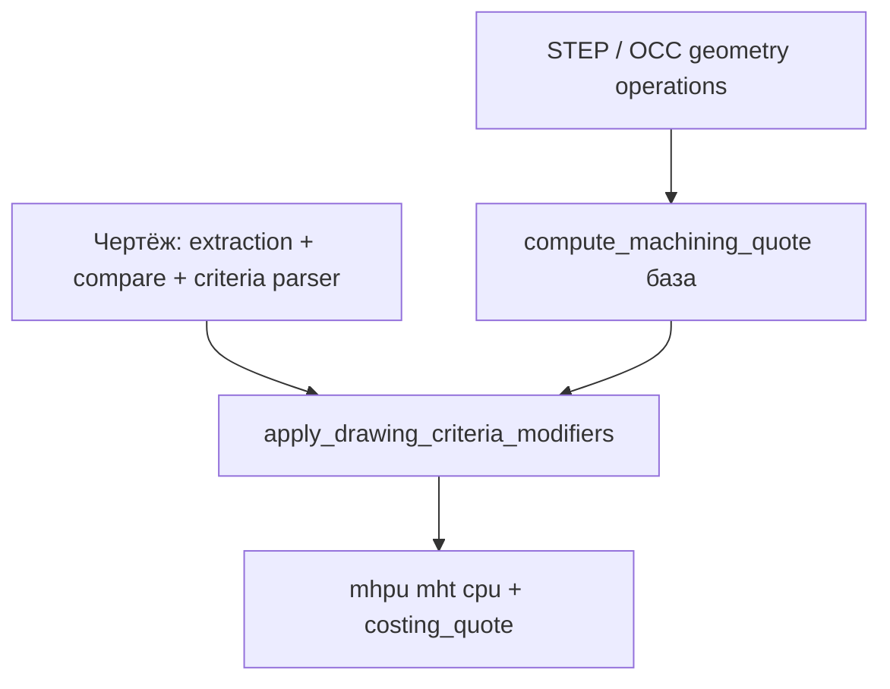

# ТЗ: стоимость с учётом чертежа, порядок блоков UI, критерии Ra/допусков

Версия: 2026-05-21  
Статус: планирование  
Связанные документы: [`TZ-drawing-analysis.md`](TZ-drawing-analysis.md) (извлечение текста, layout, сверка с STEP)

---

## 0. Цели

1. **Порядок на странице загрузки:** блоки «Стоимость за изделие» и «Распределение затрат» — **ниже** «Экспертного анализа», **выше** «Технологической карты».
2. **База расчёта по STEP** — без изменений логики объёма, съёма, `removal_rate`, семейства, OCC-установов (как сейчас в `machining_cost.py`).
3. **После анализа чертежа** — детерминированные **критерии из чертежа** влияют на время резания, наладку, УП и (при необходимости) процессы; цена пересчитывается **сразу** после успешного анализа PDF.
4. **Экспертный анализ** — тот же поток (`scan-risk` → `expert-analysis`), текст LLM не заменяет расчёт; критерии для ₽/ч берутся из **парсера + STEP**, не из «догадок» модели.

---

## 1. Текущее состояние (референс)

| Область | Файл | Сейчас |
|---------|------|--------|
| Порядок UI | `page_modules/5_Upload.py` | Параметры → **Стоимость** → Экспертный анализ (внутри — техкарта) |
| Расчёт | `machining_cost.py` | `compute_machining_quote()` только `geometry` + `operations` из STEP |
| Чертёж | `drawing_analysis/*`, `expert_analyzer.py` | `drawing_extraction`, `drawing_compare`, поля `roughness[]` |
| Анализ PDF | `page_modules/pdf_analysis.py` | После анализа — session `drawing_extraction_*`, без пересчёта стоимости |
| Техкарта | `render_tech_card_button` | Внутри `render_expert_analysis_section`, нужен `costing_quote` |

**Целевой порядок UI:**

```
3D + Параметры (справа)
---
🤖 Экспертный анализ (загрузка PDF, «Анализировать», текст, Чертёж vs модель)
---
🧾 Стоимость за изделие + 📊 Распределение затрат  ← перенос сюда
---
🛠️ Технологическая карта (кнопка + результат; quote уже посчитан)
```

---

## 2. Принципы расчёта



- **База** = текущий `compute_machining_quote(...)` без чертежа.
- **Модификаторы** = только при наличии успешного `drawing_manufacturing_criteria` (после анализа PDF).
- **Операции из STEP** не перезаписываются LLM; при `Ra < 1.6` в критериях — **добавить** процесс «Шлифование» в производный список для наладки/станков (если ещё нет в `operations`).
- **Сверка** `drawing_compare` (этап 1 drawing-analysis) остаётся; критерии стоимости — **отдельный** модуль.

---

## 3. Каталог критериев (v1)

Детекция: regex + поля `drawing_extraction.fields` + `parsed_dimensions` + при необходимости фрагмент экспертного текста (только как доп. источник, не как истина по Ø).

| ID | Условие (чертёж) | Влияние на расчёт | Примечание |
|----|------------------|-------------------|------------|
| `ra_finish_16` | min(Ra) ≤ 1.6 (вкл. «Ra 1,6», «Ra1.6») | ↑ резание (финишный проход), ↑ наладка (режимы финиш), ↑ УП | Токарная или фрезерная **чистовая** по общей технологии |
| `ra_grinding` | min(Ra) **<** 1.6 | + процесс «Шлифование», **коэфф. к цене** (не только время), ↑ наладка | Отдельный станок/переналадка |
| `hole_tolerance` | H7/H8/H6, ±0.0x на Ø, «сквозное с допуском», квалитет в тексте | ↑ резание (2 прохода: черновой+чистовой), ↑ наладка, **+ время контроля** | Чистовые отверстия |
| `threaded_hole` | M3–M24, «резьба», «Резьба», thread | ↑ УП, ↑ сверление/фрезерование/токарка по кол-ву | |
| `keyway` | «шпон», «шпоночн», «паз» + ширина (3–20 мм) | ↑ наладка (оснастка), ↑ УП, **чистовой фрезерный паз** ±0.01 | Однозначный критерий точной обработки |
| `finish_pass_global` | агрегат: ra_finish_16 ∨ hole_tolerance ∨ keyway | множитель на `cutting_per_part_h` | |

Коэффициенты v1 (в `drawing_analysis/criteria_config.py` или env, калибровка позже):

| Параметр | Env (пример) | Default |
|----------|--------------|---------|
| Множитель резания (финиш) | `SINLEX_DRAW_CRIT_CUT_MULT` | `1.15` |
| Множитель наладки | `SINLEX_DRAW_CRIT_SETUP_MULT` | `1.20` |
| Множитель УП | `SINLEX_DRAW_CRIT_CAM_MULT` | `1.25` |
| Доп. ч наладки на критерий (сумма) | `SINLEX_DRAW_CRIT_SETUP_ADD_H` | `0.4` |
| Доп. ч контроля/измерения на деталь | `SINLEX_DRAW_CRIT_MEASURE_H` | `0.25` |
| Множитель **цены** при шлифовании | `SINLEX_DRAW_CRIT_GRIND_PRICE_MULT` | `1.35` |
| Доп. ч УП на резьбу (за шт) | `SINLEX_DRAW_CRIT_THREAD_CAM_H` | `0.35` |
| Доп. ч УП на шпон. паз | `SINLEX_DRAW_CRIT_KEYWAY_CAM_H` | `1.0` |

Формула (концепт):

```
cutting' = cutting * cut_mult
setup'    = (setup + setup_add_h) * setup_mult
cam'      = (cam + thread_h + keyway_h) * cam_mult
mhpu'     = cutting' + setup'/batch + measure_h
price'    = (mhpu' + cam'/batch) * rate;  if grinding: price' *= grind_price_mult
```

---

## 4. Контракт данных

### 4.1 `DrawingManufacturingCriteria` (в session + project + `geometry`)

```json
{
  "version": 1,
  "pdf_hash": "sha256...",
  "detected": {
    "ra_values_mm": [3.2, 1.6],
    "ra_min": 1.6,
    "ra_finish_16": true,
    "ra_grinding": false,
    "toleranced_holes": 2,
    "threaded_holes": 1,
    "keyway": true,
    "keyway_width_mm": 5.0
  },
  "modifiers": {
    "cutting_mult": 1.15,
    "setup_mult": 1.2,
    "cam_mult": 1.25,
    "setup_add_h": 0.4,
    "measure_per_part_h": 0.25,
    "grind_price_mult": 1.0,
    "operations_add": []
  },
  "active_codes": ["ra_finish_16", "hole_tolerance", "threaded_hole", "keyway"],
  "summary_ru": "Ra 1.6, 2 отв. с допуском, резьба M6, шпоночный паз"
}
```

### 4.2 Расширение `compute_machining_quote` → `costing_breakdown`

В ответ добавить (не ломая старые ключи):

```json
"drawing_criteria": { ... },
"quote_base": { "mhpu": ..., "cutting_per_part_h": ... },
"quote_adjusted": { "mhpu": ..., "cpu": ... }
```

### 4.3 `costing_quote` для техкарты

Дополнительные строки (русские подписи):

- `Критерии чертежа (расчёт)`
- `Доп. время контроля, ч`
- `Шлифование (коэфф. цены)` — если применимо

### 4.4 Версия пересчёта

`COSTING_CRITERIA_VERSION` в конфиге (начать с `1`); смена правил → новый кэш не обязателен (расчёт on-the-fly в UI).

---

## 5. Этапы (форки чата)

Каждый этап — отдельная ветка/чат. В начале:

```
Реализуй Этап N из /opt/sinlex/docs/TZ-costing-drawing-criteria.md.
Не трогай этапы N+1.
```

---

### Этап UI-0 — Порядок блоков на странице

**Файлы:** `page_modules/5_Upload.py`, `page_modules/pdf_analysis.py`

**Задачи:**

1. В `5_Upload.py` после параметров/3D вызывать **только** `render_expert_analysis_section(..., quote=None)` — без предварительного `cost`.
2. Ниже — `render_costing_section(..., drawing_criteria=session)`.
3. Ниже — `render_tech_card_section(deep, step_data, quote)` — вынести `render_tech_card_button` из экспертного блока.
4. `build_costing_quote_for_tech_card` вызывать **после** `cost`, перед техкартой.

**Критерии приёмки:**

- [x] Визуально: эксперт → стоимость → техкарта.
- [x] Техкарта получает актуальный `costing_quote` с цифрами из блока стоимости.
- [x] Без PDF стоимость считается только по STEP (как раньше).

**Не делать:** критерии Ra, модификаторы.

---

### Этап CR-1 — Парсер критериев из чертежа

**Файлы:**

- `drawing_analysis/manufacturing_criteria.py` (новый)
- `drawing_analysis/criteria_config.py` или секция в `config.py`
- `tests/test_manufacturing_criteria.py`

**Функции:**

- `extract_manufacturing_criteria(drawing_extraction, drawing_compare=None, expert_text="") -> dict`
- Парсинг: `Ra`, `Rz`, H6–H11, `±0.01`, `M6`, `резьба`, `шпон`, `паз`, «допуск» рядом с Ø.

**Критерии приёмки:**

- [x] Текст `Ra 1.6` → `ra_finish_16=true`, `ra_grinding=false`.
- [x] `Ra 0.8` → `ra_grinding=true`, `operations_add` содержит «Шлифование».
- [x] `2×Ø6.4 H7` или «Ø6.4 +0.02» → `toleranced_holes >= 1`.
- [x] «шпоночный паз 5» → `keyway=true`.
- [x] `M6` / «резьба M6» → `threaded_holes >= 1`.
- [x] Пустой чертёж → пустой `active_codes`, модификаторы = 1.0.

**Не делать:** изменение `machining_cost.py`, UI.

---

### Этап CR-2 — Модификаторы в `machining_cost.py`

**Файлы:** `machining_cost.py`, `tests/test_machining_criteria_cost.py`

**Задачи:**

1. `apply_drawing_criteria_to_quote(quote: dict, criteria: dict | None) -> dict`
2. В `compute_machining_quote` опциональный аргумент `drawing_criteria=None`; внутри — база, затем apply.
3. Учёт `measure_per_part_h` в `mhpu` (станок + контроль).
4. При `ra_grinding` — `grind_price_mult` на итоговую `cpu` / `tc` (или отдельная строка в breakdown).

**Критерии приёмки:**

- [x] Без criteria — побитово совпадает с текущим расчётом (регрессионный тест).
- [x] С `keyway` + `ra_finish_16` — `mhpu` и `cam_per_part_h` строго больше базы.
- [x] С `ra_grinding` — `grind_price_mult` > 1 отражён в цене.
- [x] `setup_breakdown` / новое поле `criteria_breakdown` для UI.

**Не делать:** автоматический rerun Streamlit.

---

### Этап CR-3 — Мгновенный пересчёт после анализа чертежа

**Файлы:** `page_modules/pdf_analysis.py`, `page_modules/costing_ui.py`, `5_Upload.py`

**Задачи:**

1. После успешного `expert-analysis` в `process_pdf_scan`:
   - `criteria = extract_manufacturing_criteria(...)`
   - `st.session_state[drawing_criteria_key(slug)] = criteria`
   - `st.session_state["costing_recalc_stamp"] = pdf_hash` (опционально)
2. `render_costing_section` читает criteria из session; при изменении `pdf_hash` без анализа — criteria сброс.
3. `st.rerun()` после завершения анализа (уже может быть — проверить, что стоимость **ниже** перерисовывается с новыми цифрами).
4. Сохранение в project: `drawing_manufacturing_criteria` в `save_project_data` вместе с `drawing_extraction`.

**Критерии приёмки:**

- [x] Загрузил PDF → «Анализировать» → без ручного F5 блок стоимости обновился (другие `mhpu`/подписи критериев).
- [x] До анализа PDF — расчёт только STEP.
- [x] Повторный анализ того же PDF с новым hash критериев — пересчёт.

**Не делать:** изменение промпта DeepSeek.

---

### Этап CR-4 — UI: отображение критериев

**Файлы:** `costing_ui.py`

**Задачи:**

1. Под заголовком «Стоимость за изделие» — `st.caption` / chips: `summary_ru` из criteria.
2. Вкладка «Наладка» или новая «Критерии чертежа»: таблица `active_codes` → множители.
3. Если есть `quote_base` vs `quote_adjusted` — показать Δ времени (опционально одна строка).

**Критерии приёмки:**

- [x] Видны активные критерии после анализа.
- [x] Нет criteria — блок не ломает верстку.

---

### Этап CR-5 — Техкарта и эксперт (согласование)

**Файлы:** `pdf_analysis.py` (`build_costing_quote`), `expert_analyzer.py` (опционально)

**Задачи:**

1. В `costing_quote` для техкарты — строки критериев и итоговое время **после** модификаторов.
2. В промпт эксперта (необязательно v1): одна строка «Критерии для расчёта (Sinlex): …» из `summary_ru`, без изменения Ø из STEP.

**Критерии приёмки:**

- [x] Техкарта в п.5 времени использует цифры **после** критериев чертежа.
- [x] Экспертный текст по-прежнему через `scan-risk` + `expert-analysis`.

---

### Этап CR-6 — Калибровка и эталоны (backlog)

- Прогон 3 чертежей (педаль + 2 скана): сравнение оценки технолога.
- Вынести коэффициенты в админ-конфиг / `criteria_config.yaml`.

**Не начинать до закрытия CR-0…CR-4.**

---

## 6. Зависимости между этапами

| Этап | Зависит от |
|------|------------|
| UI-0 | — |
| CR-1 | drawing-analysis этапы 0–1 (extraction, fields) |
| CR-2 | CR-1 |
| CR-3 | UI-0, CR-2 |
| CR-4 | CR-3 |
| CR-5 | CR-3 |

Рекомендуемый порядок форков: **UI-0 → CR-1 → CR-2 → CR-3 → CR-4 → CR-5**.

---

## 7. Что не входит в v1

- Vision-LLM (этап 4 drawing-analysis) — отдельно.
- Автоматическое изменение `operations` в UI пользователем (только производный список для расчёта шлифования/наладки).
- Отдельная строка «измерение» в КП PDF (в разработке).
- Парсинг размерных линий с изображения (этап 5 drawing-analysis).

---

## 8. Тестовые сценарии (сквозные)

| ID | Вход | Ожидание |
|----|------|----------|
| T1 | Только STEP, без PDF | Стоимость = база, нет chips критериев |
| T2 | STEP + PDF «Ra 3.2», без допусков | База или слабый mult (< Ra 1.6) |
| T3 | PDF «Ra 1.6», 2×Ø6.4 H7, M6, шпон. паз | finish + tolerance + thread + keyway; mhpu ↑ |
| T4 | PDF «Ra 0.4» | Шлифование в criteria; price × grind_mult |
| T5 | UI порядок | Эксперт выше стоимости, техкарта ниже стоимости |

---

## 9. Чеклист готовности продукта

- [x] UI-0
- [x] CR-1
- [x] CR-2
- [x] CR-3
- [x] CR-4
- [x] CR-5
- [ ] Документ коэффициентов согласован с технологом
- [ ] `systemctl restart sinlex-streamlit` после деплоя

---

## 10. Промпты для форков (копипаст)

**UI-0:**
> Переставь блоки в 5_Upload: экспертный анализ выше, стоимость ниже, техкарта вынесена под стоимость. TZ: docs/TZ-costing-drawing-criteria.md этап UI-0.

**CR-1:**
> manufacturing_criteria.py: Ra, допуски отверстий, резьба, шпон. паз. TZ этап CR-1.

**CR-2:**
> machining_cost.py: apply_drawing_criteria_to_quote. TZ этап CR-2.

**CR-3:**
> После expert-analysis — criteria в session и мгновенный пересчёт стоимости. TZ этап CR-3.

---

*Конец ТЗ. При изменении формул обновлять `COSTING_CRITERIA_VERSION` и таблицу коэффициентов в §3.*
