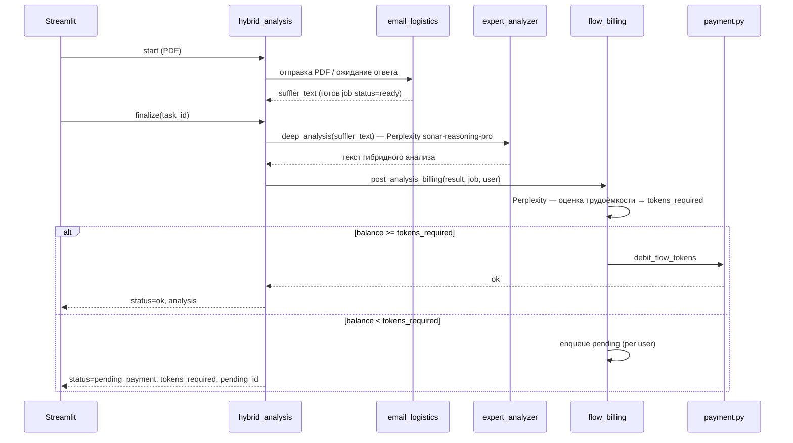

# ТЗ: карточка «Поток» на странице «Тарифы» — баланс токенов и пополнение через ЮKassa

Версия: 2026-05-26 (доп. биллинг Поток)  
Статус: **этап 1 внедрён** (пополнение + UI); **этапы 2–8 не реализованы** (списание, pending, gate)  
Исходник: задание для Cursor (копия от заказчика, 2026-05-26)  
**Обновление UI 2026-05-25:** см. **§0** — обязательно прочитать перед этапами 2+

Связанные документы:

- [`postmortem-topbar-h1-layout.md`](postmortem-topbar-h1-layout.md) — **postmortem:** неудачные попытки выровнять `h1` под топбар (откат, уроки)
- [`TZ-hybrid-deep-analysis.md`](TZ-hybrid-deep-analysis.md) — модуль «Поток» (углублённый / гибридный анализ)
- [`page_modules/pdf_analysis.py`](../page_modules/pdf_analysis.py) — кнопка «Поток», подсказка про токены (1 токен = 10 ₽)
- [`payment.py`](../payment.py), [`api/routers/payments.py`](../api/routers/payments.py) — текущая ЮKassa и тарифы
- [`page_shell.py`](../page_shell.py) — глобальный топбар «Баланс», dialog пополнения (§0)

---

## 0. Уже внедрено в прод (не ломать при этапах 2+)

> **Для Жорика:** этот раздел фиксирует фактическую архитектуру после патчей Cursor (май 2026).  
> Не возвращать удалённую логику в `3_Payment.py` и не дублировать виджет баланса на отдельных страницах.

### 0.1. Этап 1 — backend и API (готово)

| Компонент | Статус |
|-----------|--------|
| `payment.py`: `get_flow_token_balance`, `credit_flow_tokens`, `create_flow_topup_payment`, `process_flow_topup_succeeded`, `purpose` в webhook/confirm | ✅ |
| `api/routers/payments.py`: `GET /payments/flow-balance`, `POST /payments/flow-topup` | ✅ |
| `tests/test_flow_tokens_payment.py` | ✅ |
| `app.py`: `_handle_payment_return_after_yookassa()` для `purpose == flow_tokens` | ✅ |

Минимум пополнения: **`FLOW_TOPUP_MIN_AMOUNT = 1000`** (`payment.py`).

### 0.2. UI — глобальный виджет «🌀 Баланс» (`page_shell.py` + `app.py`)

**Не** только на странице «Тарифы». Виджет живёт на **всех страницах после входа** (не гость).

| Файл | Функция / что делает |
|------|----------------------|
| `page_shell.py` | `render_app_flow_balance_bar()` — верхняя строка, popover справа |
| `page_shell.py` | `fetch_flow_balance()` — `GET /payments/flow-balance`, кеш `st.session_state.flow_balance_cache` |
| `app.py` | Вызов `_render_app_flow_balance_bar()` **до** контента страницы (после сайдбара) |

**Вёрстка топбара (не откатывать на `sticky`):**

- Строка **фиксирована** к viewport: CSS `position: fixed` + JS `fixTopbar()` в `_inject_main_scroll_clamp()` (`app.py`).
- Для `st.html` со скриптом обязательно: **`unsafe_allow_javascript=True`** (Streamlit ≥ 1.57).
- Под строкой — spacer `#sinlex-topbar-spacer` (высота задаётся JS/CSS), иначе контент заезжает под бар.
- Popover: `st.popover("Баланс", icon="🌀", key="global_flow_balance_popover")` — эмодзи **рядом** с текстом, не в label.
- Сайдбар 270px: `left: 270px` в CSS; JS пересчитывает `left`/`width` от `getBoundingClientRect()` области `stMain`.

**Порядок вызовов в `app.py` (после авторизации):**

```text
_render_app_flow_balance_bar()
_maybe_redirect_to_yookassa()          # page_shell — редирект на ЮKassa с любой страницы
_render_flow_topup_dialog_if_open()    # page_shell — модалка пополнения
_enforce_tariff_wall(...)
… контент страницы …
```

### 0.3. Пополнение — модальное окно, не блок на «Тарифах»

| Было (черновик ТЗ) | Сейчас в коде |
|--------------------|---------------|
| Форма в `st.container` на `3_Payment.py` | **`@st.dialog` `flow_topup_dialog()`** в `page_shell.py` |
| Кнопка «Пополнить» → `page=payment` | **`st.session_state.show_flow_topup_form = True`** + `st.rerun()` **без смены страницы** |
| Редирект ЮKassa только из `3_Payment.py` | **`maybe_redirect_to_yookassa()`** в `page_shell.py`, вызов из `app.py` |

**Session state (пополнение):**

- `show_flow_topup_form` — открыть модалку (`render_flow_topup_dialog_if_open()`).
- `payment_redirect_url` — URL ЮKassa; обрабатывается глобально, затем `st.stop()`.
- `pending_payment_id`, `pending_payment_purpose` (`flow_tokens`) — как у тарифов.
- `start_flow_topup(amount)` — **только** в `page_shell.py` (не дублировать в `3_Payment.py`).

**Точки входа «Пополнить баланс»:**

1. Popover в топбаре (`global_flow_topup_btn`).
2. Карточка «Поток» на `3_Payment.py` (`pay_flow_topup_card`) — только выставляет `show_flow_topup_form`.

**Ограничение Streamlit:** только **один** `@st.dialog` за run скрипта; не открывать второй dialog поверх `flow_topup_dialog`.

### 0.4. `3_Payment.py` — что убрано намеренно

- ❌ Popover «🌀 Баланс» в шапке страницы (дубликат глобального).
- ❌ Inline-форма `flow_topup_form` в `st.container(border=True)`.
- ❌ `_start_flow_topup()` и блок `meta refresh` для `payment_redirect_url`.

Карточка **«Поток»** (4-я колонка, `#14b8a6`) и кнопка «Пополнить баланс» на тарифах — **остаются**.

### 0.5. Смежные патчи (не относится к биллингу, но в том же деплое)

| Изменение | Файлы |
|-----------|--------|
| Выход в той же вкладке | `GET /api/auth/logout`, сайдбар `app.py` → meta refresh на `/api/auth/logout?sid=…` |
| Кнопка «Поток» / подсказка / STEP-статусы | `page_modules/pdf_analysis.py`, `page_modules/5_Upload.py` |

### 0.6. Ещё не делать повторно (этапы 2–8)

- `debit_flow_tokens`, `flow_billing.py`, очередь `data/flow_pending/`
- Gate в `finalize_hybrid_job`, disable «Поток» при balance=0
- `POST /payments/flow-pending/release`

При реализации этапа 2+ **использовать** `page_shell.fetch_flow_balance()` / `flow_balance_cache` для UI, не плодить второй запрос с другим ключом session_state (`flow_balance` в §12.5 устарел — см. `flow_balance_cache`).


## 1. Цель

На странице **«Тарифы»** (`page_modules/3_Payment.py`) добавить:

1. **Четвёртую карточку «Поток»** — баланс токенов, описание, кнопка «Пополнить баланс».
2. **Виджет «🌀 Баланс»** (popover) в **глобальной верхней строке** всех страниц приложения — см. **§0.2** (`page_shell.py`).
3. **Пополнение через ЮKassa** (карта): токены = сумма в ₽ ÷ 10 (1 токен = 10 ₽).
4. **Заглушка** «Оплата по счёту для юр.лиц (скоро)».

После успешной оплаты баланс увеличивается в `data/user_payments/<folder>.json`, отображается в UI.

**В скоупе этого ТЗ (фаза биллинга «Поток»):** пополнение токенов, списание после анализа, блокировка при нулевом балансе, очередь pending до пополнения.

---

## 2. Анализ текущего состояния (as-is)

### 2.1. Страница тарифов

| Факт | Детали |
|------|--------|
| Файл | `page_modules/3_Payment.py` |
| Сетка | `st.columns([1, 1, 1])` — **3** карточки из `payment.TARIFF_PLANS` |
| Оплата | `POST {SINLEX_API_URL}/payments/create` с `tariff_id`, `return_sid` |
| Редирект | `st.session_state.payment_redirect_url` + `meta refresh` (как у тарифов) |
| Авторизация API | `utils.get_headers()` → `X-API-Key`, `X-User-Email` |

Переменная `NGROK_URL` в коде = `os.environ.get("SINLEX_API_URL", "http://127.0.0.1:8001")` (`utils.py`). Публичный префикс nginx: **`/api/`** → `https://sinlex.tech/api/...`.

### 2.2. Платежи и webhook (уже есть)

| Компонент | Путь / файл |
|-----------|-------------|
| FastAPI app | `api/app.py` (не `visual_server.py` — там только `uvicorn`) |
| Роутер | `api/routers/payments.py`, prefix `/payments` |
| Создание платежа | `POST /payments/create` → `payment.create_payment()` |
| Webhook ЮKassa | `POST /payments/webhook/yookassa` → `payment.handle_webhook()` |
| Подтверждение с return | `POST /payments/confirm/{payment_id}` → `process_payment_succeeded()` → **`activate_tariff()`** |
| Реестр платежей | `data/payments.json` (`register_payment`) |
| Return URL | `payment.build_return_url(sid=...)` → `https://sinlex.tech/app/?sid=...` |

Webhook **уже проксируется** nginx (`location ^~ /api/`). URL для ЛК ЮKassa:

```text
https://sinlex.tech/api/payments/webhook/yookassa
```

**Не создавать** дублирующий `/payment-webhook` из черновика задания.

### 2.3. Профиль пользователя `user_payments`

| Факт | Детали |
|------|--------|
| Каталог | `/opt/sinlex/data/user_payments/` |
| Имя файла | **`{folder}.json`** из `accounts.json` → поле `folder` (напр. `kvant_metall.json`), **не** slug от email |
| Чтение/запись | `payment._user_payment_file()`, `_load_user_payment()`, `_save_user_payment()` |
| Текущие поля | `tariff_id`, `tariff_active_until`, `project_limit`, `projects_uploaded_total`, … |
| **`flow_tokens` / `transactions`** | **отсутствуют** в коде и в существующих JSON |

Пример реального файла: `kvant_metall.json` (без `flow_tokens`).

### 2.4. Модуль «Поток» (анализ)

- UI: кнопка **«Поток»** в `pdf_analysis.py`, гибрид через `hybrid-analysis/*`.
- Списание токенов и постанализ трудоёмкости **не реализованы** (см. §12–13).
- Подсказка пользователю: «1 токен = 10 рублей» (`POTOK_HELP_TOOLTIP`).

---

## 3. Расхождения черновика задания с репозиторием (обязательно учесть)

| В черновике | Как правильно в Sinlex |
|-------------|-------------------------|
| Правки в `visual_server.py` | Правки в **`api/routers/payments.py`** + **`payment.py`**; `visual_server.py` не трогать |
| `from data.user_payments import ...` | **Нет** отдельного пакета `data/` как модуля Python. Логику хранить в **`payment.py`** |
| Файл `user_payments/<user>.json` по email | Файл **`user_payments/<folder>.json`** (см. `_user_payment_file`) |
| `POST /create-payment` | **`POST /payments/create`** (тариф) и новый **`POST /payments/flow-topup`** |
| `GET /user/tokens-balance` | **`GET /payments/flow-balance`** |
| `return_url: https://sinlex.tech/payment-success` | **`payment.build_return_url(sid=auth_sid)`** + `app._handle_payment_return_after_yookassa()` |
| Новый webhook `/payment-webhook` | Расширить **`handle_webhook` / `process_payment_succeeded`** по `metadata.purpose` |
| `create_payment` без receipt | Сохранить **`receipt` 54-ФЗ** (`_build_receipt`) и `user_email` в metadata |
| `st.button` внутри `st.form` для «скоро» | В форме только `form_submit_button`; «Закрыть» — **вне** формы |
| Ссылка `target="_blank"` | Паттерн тарифов: **`payment_redirect_url`** + meta refresh |

---

## 4. Целевая модель данных

### 4.1. Расширение `data/user_payments/<folder>.json`

Существующие поля тарифа **не удалять**. Добавить `flow_tokens` (int ≥ 0) и `transactions[]` (см. черновик задания).

Идемпотентность: не добавлять `deposit` с тем же `payment_id` дважды.

### 4.2. Расширение `data/payments.json`

Поле `purpose`: `"tariff"` | `"flow_tokens"`.

### 4.3. Metadata ЮKassa для пополнения

```json
{
  "user_email": "user@example.com",
  "purpose": "flow_tokens",
  "amount_tokens": "1000"
}
```

---

## 5. Backend

### 5.1. Функции в `payment.py`

- `get_flow_token_balance(user_email) -> int`
- `credit_flow_tokens(user_email, amount, payment_id, ...)`
- `create_flow_topup_payment(user_email, amount_rub, return_url) -> (url, payment_id)`
- `process_flow_topup_succeeded(...)`
- Ветвление в `process_payment_succeeded` по `purpose`
- Расширение `is_activation_result` для flow-topup

Минимум пополнения: **1000 ₽**.

### 5.2. API

| Метод | Путь |
|-------|------|
| `GET` | `/payments/flow-balance` |
| `POST` | `/payments/flow-topup` body: `{ "amount": 1000, "return_sid": "" }` |

---

## 6. UI — `3_Payment.py` + `page_shell.py`

- Сетка **4 колонки**; карточка `plan_card_flow`, акцент `#14b8a6`.
- Popover **«🌀 Баланс»** — **глобально** в `page_shell.render_app_flow_balance_bar()` (не в шапке `3_Payment.py`).
- Пополнение: **`@st.dialog`** в `page_shell.flow_topup_dialog()`; min 1000 ₽; `POST /payments/flow-topup`; заглушка юр.лиц — см. **§0.3**.

---

## 7. Return — `app.py`

При `purpose == "flow_tokens"`: сообщение «Зачислено N токенов», не «Тариф активирован».

### 4.1. Пример JSON (полный)

```json
{
  "user_email": "info@example.com",
  "user_folder": "company_folder",
  "tariff_id": "start",
  "tariff_name": "Старт",
  "tariff_active_until": "2026-06-26T00:00:00+00:00",
  "flow_tokens": 46,
  "transactions": [
    {
      "date": "2026-05-26T10:00:00+00:00",
      "type": "deposit",
      "amount": 1000,
      "source": "yookassa",
      "payment_id": "abc-123",
      "purpose": "flow_tokens"
    }
  ],
  "updated_at": "2026-05-26T12:00:00+00:00"
}
```

---

## 5.3. Псевдокод `credit_flow_tokens`

```python
def credit_flow_tokens(user_email, amount, payment_id, source="yookassa"):
    profile = _load_user_payment(user_email) or {}
    profile.setdefault("transactions", [])
    if any(t.get("payment_id") == payment_id for t in profile["transactions"]):
        return {"already_credited": True, "balance": profile.get("flow_tokens", 0)}
    profile["flow_tokens"] = int(profile.get("flow_tokens", 0)) + int(amount)
    profile["transactions"].append({...})
    profile["user_email"] = user_email
    profile["user_folder"] = _get_user_folder(user_email)
    profile["updated_at"] = _now_iso()
    _save_user_payment(user_email, profile)
    return {"credited": amount, "balance": profile["flow_tokens"]}
```

---

## 6. UI — детали `3_Payment.py`

### 6.1. CSS

- Расширить селекторы `[class*="st-key-plan_card_"]` на 4 колонки.
- Для `plan_card_flow`: border-color `#14b8a6`, hover как у basic, но бирюзовый.

### 6.2. Форма пополнения (логика) — **актуально §0.3**

```python
# session_state
show_flow_topup_form: bool          # открывает st.dialog
pending_payment_purpose: "flow_tokens" | "tariff"
flow_balance_cache: int             # page_shell.fetch_flow_balance()

# submit — page_shell.start_flow_topup(amount), не дублировать в 3_Payment.py
# → payment_redirect_url, pending_payment_id, pending_payment_purpose="flow_tokens"
# → maybe_redirect_to_yookassa() в app.py (глобально)
```

### 6.3. Ошибки UI

- API 401 → «Войдите в аккаунт»
- amount < 1000 → валидация `number_input` + сервер 400
- ЮKassa не настроена → текст из exception `create_payment`

---

## 7. Return — `app.py` (детально)

После `payments/confirm` для flow:

```python
if result.get("balance") is not None:
    st.session_state.payment_return_notice = (
        "success",
        f"Зачислено **{result.get('credited', '')}** токенов. Баланс: **{result['balance']}**.",
    )
```

Очистить: `pending_payment_id`, `pending_payment_purpose`, `yookassa_return_checked` (как сейчас).

---

## 8. Этапы реализации

| # | Этап | Критерий |
|---|------|----------|
| 1 | `payment.py`: balance, credit, register `purpose` | unit: идемпотентность |
| 2 | `create_flow_topup_payment`, ветка webhook/confirm | тестовый платёж + JSON |
| 3 | API `flow-balance`, `flow-topup` | curl |
| 4 | UI 4-я карточка + popover + форма | Streamlit |
| 5 | `app.py` return | сообщение о токенах |
| 6 | Прод: webhook URL в ЮKassa | зачисление без ручного confirm |


---

## 9. Тест-план

- [ ] Баланс 0 для нового пользователя
- [ ] Пополнение 1000 ₽ → +100 токенов
- [ ] Повторный webhook не дублирует
- [ ] Тариф Старт по-прежнему активируется
- [ ] `user_payments/<folder>.json` валиден
- [ ] Гость не пополняет

---

## 10. Риски

| Риск | Митигация |
|------|-----------|
| Путаница tariff / flow | поле `purpose` везде |
| Старые JSON | default `flow_tokens=0` |
| Один uvicorn worker | webhook только запись файла |

---

## 11. Справка: текст подсказки «Поток»

Из `POTOK_HELP_TOOLTIP` в `pdf_analysis.py` (кнопка анализа чертежа).

---

## 12. Списание токенов за анализ «Поток» (страница проекта / «Анализ чертежа»)

### 12.1. Место в продукте

| UI | Файл | Действие |
|----|------|----------|
| Кнопка **«Поток»** | `page_modules/pdf_analysis.py` → `render_drawing_action_buttons` | Запуск гибрида; блокировка при `balance == 0` |
| Опрос / финализация | `_tick_hybrid_poll` → `POST /hybrid-analysis/finalize/{task_id}` | Получение результата только после биллинга |
| Страница проекта (Upload) | `page_modules/5_Upload.py` + `render_expert_analysis_section` | Тот же блок «Анализ чертежа» |

Тариф «Старт/Базовый/Предприятие» **не заменяет** токены Потока: подписка даёт доступ к платформе, «Поток» оплачивается отдельным балансом (1 токен = 10 ₽), если пользователь не `tariff_exempt` (для admin — отдельное правило в §12.6).

### 12.2. Когда списывать (не при старте job)

**Не** списывать токены при `POST /hybrid-analysis/start`.

Списание — **после** полного пайплайна:



### 12.3. Бэкенд: ИИ-постанализ трудоёмкости (Perplexity)

**Новый модуль (рекомендуется):** `flow_billing.py` или функции в `payment.py` + вызов LLM из `expert_analyzer.py`.

**Функция:** `estimate_flow_tokens(user_email, job: dict, analysis_text: str, metadata: dict) -> dict`

| Поле ответа | Тип | Описание |
|-------------|-----|----------|
| `tokens_required` | int | Сколько списать (≥ 1), 1 токен = 10 ₽ |
| `labor_assessment` | str | Краткий вывод о трудоёмкости (для лога / админки) |
| `billing_model` | str | напр. `sonar-reasoning-pro` |
| `billing_prompt_version` | str | версия промпта для аудита |

**Промпт (Perplexity, structured output):** на входе — длина/сложность `suffler_text`, объём `analysis_text`, признаки из `job` (`auto_extraction`, `auto_compare`, число листов PDF, `project_name`). Модель **обязана** вернуть JSON (не свободный текст):

```json
{
  "tokens_required": 12,
  "labor_level": "medium",
  "rationale": "Много размерных цепочек, нестандартные допуски, ручная нормировка."
}
```

Правила оценки (зафиксировать в промпте при реализации):

- Минимум **1** токен за любой успешный анализ.
- Верхний предел на один анализ (напр. **500** токенов) — защита от runaway.
- Округление вверх до целого токена.

**Вызов:** отдельный запрос Perplexity (`sonar` или `sonar-reasoning-pro`), **не** парсить произвольный markdown основного анализа — только JSON-постанализ.

**Точка вставки в код:** в `hybrid_analysis.finalize_hybrid_job()` **после** `deep_analysis(...)`, **до** `return result`:

```python
billing = run_flow_billing_gate(
    user_email=merged_step.get("user_email") or from_header,
    user_folder=user_folder,
    task_id=task_id,
    project_name=project_name,
    analysis_result=result,
    job=job,
)
if billing["status"] == "pending_payment":
    return billing  # без поля analysis в UI
return billing["result"]  # analysis + tokens_debited
```

Передать `user_email` в job при `start_hybrid_analysis` (поле `user_email` в `hybrid_jobs/{task_id}.json`).

### 12.4. Списание: `debit_flow_tokens`

```python
def debit_flow_tokens(
    user_email: str,
    amount: int,
    *,
    source: str = "flow_analysis",
    project: str = "",
    task_id: str = "",
    pending_id: str = "",
) -> dict:
```

- `amount` — положительное число; в `transactions[]` пишется **отрицательное** `amount`.
- Идемпотентность: уникальный ключ `(source, task_id)` или `idempotency_key` в transaction — **не списывать дважды** за один `task_id`.
- При успехе: `{ "balance": N, "debited": amount }`.
- При `balance < amount`: `{ "ok": False, "reason": "insufficient_balance" }` → pending (§13).

### 12.5. UI: баланс 0 — деактивация «Поток»

**Где:** `render_drawing_action_buttons` / `render_expert_analysis_section` (`pdf_analysis.py`).

**Поведение:**

| Условие | UI |
|---------|-----|
| `flow_tokens == 0` (и не exempt) | Кнопка **«Поток»** `disabled=True` |
| | Под кнопками или у подсказки «?»: «Недостаточно токенов. [Пополнить баланс](/app?page=payment)» (ссылка на страницу тарифов) |
| `flow_tokens > 0` | Кнопка активна (если `_hybrid_button_allowed`) |
| Гость | Как сейчас — без оплаты |

Баланс: `GET /payments/flow-balance` (кеш в `st.session_state.flow_balance_cache` через `page_shell.fetch_flow_balance()`, сброс после return topup в `app.py`).

**Не запускать** `hybrid-analysis/start` с сервера при balance=0 (дублирующая проверка в `hybrid_start` → HTTP 402).

---

## 13. Очередь pending (недостаточно токенов после готового анализа)

### 13.1. Сценарий

1. Ответ **email_logistics** получен, `job.status = ready`.
2. `finalize` собрал гибридный текст (`deep_analysis` успешен).
3. Постанализ выставил `tokens_required = N`.
4. На балансе `M < N` → результат **не отдаём в UI**, сохраняем в **очередь пользователя**.

Пользователь видит сообщение вместо текста анализа:

> Анализ «Поток» выполнен. Для просмотра результата пополните баланс: нужно **N** токенов, на счёте **M**. [Перейти к пополнению]

### 13.2. Хранение (per user)

**Каталог:** `/opt/sinlex/data/flow_pending/`  
**Файл:** `{folder}.json` (тот же `folder`, что в `accounts.json` — **не** per-project).

```json
{
  "user_email": "user@example.com",
  "user_folder": "company_folder",
  "updated_at": "2026-05-26T12:00:00+00:00",
  "queue": [
    {
      "pending_id": "fp_8f3c2a1b",
      "task_id": "hybrid-uuid",
      "project_name": "Корпус 078",
      "project_slug": "корпус_078",
      "created_at": "2026-05-26T11:05:00+00:00",
      "tokens_required": 42,
      "result_payload": {
        "status": "ok",
        "analysis": "…",
        "drawing_extraction": {},
        "hybrid_task_id": "…"
      }
    }
  ]
}
```

- **Очередь FIFO** в рамках одного пользователя.
- `result_payload` — полный ответ, который **бы** ушёл в UI (включая `drawing_extraction`, criteria и т.д.).
- Несколько pending по разным проектам — допустимо; при пополнении обрабатывать по порядку, пока хватает баланса.

### 13.3. API / статусы finalize

Расширить ответ `POST /hybrid-analysis/finalize/{task_id}`:

| status | Значение |
|--------|----------|
| `ok` | Списано, `analysis` в ответе |
| `pending_payment` | В очереди, `analysis` **нет** (или пустой) |
| `error` / `timeout` | как сейчас |

Доп. поля при `pending_payment`:

```json
{
  "status": "pending_payment",
  "tokens_required": 42,
  "balance": 5,
  "pending_id": "fp_8f3c2a1b",
  "ui_message": "Пополните баланс для просмотра результата."
}
```

**UI (`_fetch_hybrid_finalize_result` / `_persist_hybrid_finalize`):**

- При `pending_payment`: **не** писать `hybrid_result_key` с текстом анализа; статус напр. `hybrid_status = "pending_payment"`; показать `st.warning` с суммой и ссылкой на тарифы.
- При последующем `flow-balance > 0` и вызове release — подтянуть результат (poll или кнопка «Обновить»).

### 13.4. Release при пополнении

В `credit_flow_tokens()` (после зачисления депозита):

```python
released = release_flow_pending_queue(user_email)
# → списание по FIFO, возврат списка { pending_id, project_name, tokens_debited }
```

**`release_flow_pending_queue(user_email)`:**

1. Загрузить `data/flow_pending/{folder}.json`.
2. Пока `balance >= head.tokens_required`:
   - `debit_flow_tokens(..., task_id=...)`
   - сохранить факт доставки (опционально `data/flow_delivered/{pending_id}.json` или флаг в job)
   - удалить элемент из очереди
3. Сохранить оставшуюся очередь.
4. Вернуть `released[]` для уведомления UI.

**UI после пополнения:**

- `app._handle_payment_return_after_yookassa` при `purpose=flow_tokens` вызывает `GET /payments/flow-pending-release` или release встроен в confirm topup response.
- Показать: «Зачислено X токенов. Результаты Потока доступны: N шт.» + ссылка на проект.
- На странице Upload при `pending_payment` — auto-rerun / кнопка «Показать результат» после release.

**Обнуление очереди:** после успешного release обработанные элементы удаляются из `queue`; необработанные (не хватило баланса) остаются.

### 13.5. Повторный finalize

Если пользователь снова жмёт «Поток» на том же чертеже при наличии pending с тем же `task_id`:

- Не запускать новый дорогой пайплайн — отдать `pending_payment` или release при достаточном балансе.
- Либо idempotent finalize: если в pending уже есть `task_id` — вернуть статус очереди.

---

## 14. Дополнительные API (сводка)

| Метод | Путь | Назначение |
|-------|------|------------|
| `GET` | `/payments/flow-balance` | Баланс (UI, gate) |
| `POST` | `/payments/flow-topup` | Пополнение ЮKassa |
| `GET` | `/payments/flow-pending` | Список pending пользователя (опционально) |
| `POST` | `/payments/flow-pending/release` | Ручной release (если не в webhook) |
| `POST` | `/hybrid-analysis/finalize/{id}` | + статусы `pending_payment` |

Заголовок: `X-User-Email` (как у остальных payments).

---

## 15. Обновлённые этапы реализации

| # | Этап | Файлы |
|---|------|-------|
| 1 | Пополнение: balance, credit, topup, UI карточка + **глобальный топбар + dialog** | ✅ `payment.py`, `payments.py`, `page_shell.py`, `3_Payment.py`, `app.py` — см. **§0** |
| 2 | `debit_flow_tokens`, transactions, идемпотентность | `payment.py` |
| 3 | `estimate_flow_tokens` (Perplexity JSON) | `flow_billing.py`, `expert_analyzer` или отдельный клиент |
| 4 | Gate в `finalize_hybrid_job` | `hybrid_analysis.py` |
| 5 | Pending queue + release on credit | `data/flow_pending/`, `payment.py` |
| 6 | UI: disable Поток при 0, pending_payment | `pdf_analysis.py` |
| 7 | Проверка balance в `hybrid_start` | `api/routers/hybrid_analysis.py` |
| 8 | E2E: анализ → недостаточно токенов → topup → результат в UI | — |

---

## 16. Тест-план (дополнение к §9)

- [ ] Баланс 0: кнопка «Поток» disabled, подсказка пополнить.
- [ ] `hybrid-analysis/start` при balance=0 → 402.
- [ ] Успешный анализ при balance ≥ N: списание N, текст в UI, transaction `spend`.
- [ ] Анализ готов, balance < N: `pending_payment`, текст **не** в UI, запись в `flow_pending/{folder}.json`.
- [ ] Пополнение до N+: `release` снимает pending, анализ появляется, очередь уменьшается.
- [ ] Два pending подряд, пополнение на сумму одного — списывается FIFO, второй остаётся в очереди.
- [ ] Повторный webhook topup / повторный release не дублирует списание по `task_id`.
- [ ] Постанализ возвращает валидный JSON; при ошибке парсинга — fallback (напр. фикс. min tokens) + запись в лог.

---

## 17. Риски (дополнение)

| Риск | Митигация |
|------|-----------|
| Долгий finalize + LLM постанализ | Увеличить timeout UI poll; постанализ с меньшим `max_tokens` |
| Пользователь закрыл вкладку до topup | Pending на диске; release при следующем входе + popover «есть готовые результаты» |
| Утечка большого `result_payload` в JSON | Лимит размера pending; хранить путь к файлу `hybrid_deliveries/{pending_id}.json` |
| Admin exempt | Явное правило: exempt не списывает токены ИЛИ безлимит — решение при реализации (по умолчанию: exempt = без списания) |

---

## 18. Файлы (полный список)

| Файл | Действие |
|------|----------|
| `payment.py` | balance, credit, debit, release pending |
| `flow_billing.py` (новый) | постанализ Perplexity, gate |
| `hybrid_analysis.py` | billing gate в finalize, `user_email` в job |
| `api/routers/hybrid_analysis.py` | 402 на start, finalize statuses |
| `api/routers/payments.py` | flow-balance, topup, optional release |
| `expert_analyzer.py` | опционально: `_call_perplexity` для billing JSON |
| `page_modules/pdf_analysis.py` | disable Поток, pending_payment UI |
| `page_shell.py` | **глобальный топбар, dialog пополнения, `start_flow_topup`, `maybe_redirect_to_yookassa`** |
| `page_modules/3_Payment.py` | карточка «Поток» (без popover/формы в странице) |
| `app.py` | вызов топбара/модалки/redirect; return topup; `fixTopbar` JS |
| `api/routers/auth.py` | `GET /auth/logout` |
| `data/flow_pending/` | новый каталог |
| `docs/TZ-flow-tokens-payment.md` | этот документ |

**Не менять:** `visual_server.py`.
