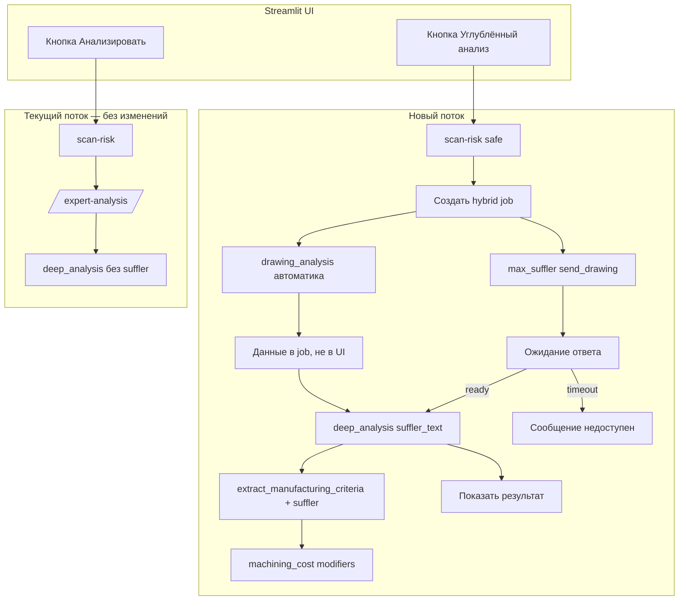

# ТЗ: углублённый анализ чертежа (гибрид: автоматика + внешний канал)

Версия: 2026-05-22  
Статус: **HS-3 завершён** (кнопка и polling в `pdf_analysis.py`; HS-4+ — критерии suffler)  
Связанные документы:
- [`TZ-drawing-analysis.md`](TZ-drawing-analysis.md) — каскад OCR, layout, сверка с STEP
- [`TZ-costing-drawing-criteria.md`](TZ-costing-drawing-criteria.md) — критерии чертежа → `machining_cost`

---

## 0. Контекст (не трогаем)

| Компонент | Файл | Роль |
|-----------|------|------|
| UI PDF | `page_modules/pdf_analysis.py` | `scan-risk` → `expert-analysis`, критерии, техкарта |
| Кнопка «Анализировать» | `render_analyze_drawing_button` → `process_pdf_scan` | Текущий поток **без изменений** |
| API | `api/routers/analysis.py` | `/scan-risk`, `/expert-analysis`, `/tech-card` |
| Автоматика чертежа | `drawing_analysis/*` | reader → layout → parser → compare |
| Эксперт (LLM) | `expert_analyzer.deep_analysis` | DeepSeek + STEP + compare + criteria |
| Стоимость | `machining_cost.compute_machining_quote` | `apply_drawing_criteria_to_quote` |
| Кэш анализа | `{project}/analysis_cache/{pdf_hash}_{step_ver}_draw_v{N}.json` | Сейчас `DRAWING_PIPELINE_VERSION = 4` |

**Токен внешнего канала (бот Макс):** только в `secrets.env` / `.env` как `MAX_SUFFLER_TOKEN`. **Не коммитить** значение токена в репозиторий и не вставлять в этот документ.

---

## 1. Цель

Добавить вторую кнопку **«Углублённый анализ»** рядом с **«Анализировать»**.

При нажатии:

1. Запускается **блокирующий гибридный процесс**: параллельно
   - автоматическое распознавание (`drawing_analysis`, как сейчас);
   - отправка PDF во **внешний канал** (бот Макс, модуль `max_suffler.py`).
2. **Результат не показывается**, пока не получен ответ внешнего канала (или не истёк таймаут).
3. Пользователь видит **только индикатор ожидания** (spinner / status), без промежуточного текста OCR/LLM.
4. После ответа формируется **итоговый анализ** с приоритетом данных:

   **внешний канал > детерминированная сверка / STEP > OCR / парсер**

5. Ответ внешнего канала участвует в `manufacturing_criteria` и пересчёте **часов / стоимости** (`machining_cost`).
6. При таймауте (по умолчанию 1 ч) — сообщение: *«Анализ временно недоступен, попробуйте позже»*, без частичного результата.

**Ограничение UX:** в UI **не упоминать** внешний канал, «суфлер», «эксперт», «технолог», «помощник», «человек». Допустимые формулировки: «Углублённый анализ», «Выполняется углублённый анализ…».

---

## 2. Целевая архитектура



**Важно:** гибрид **не заменяет** `/expert-analysis` для кнопки «Анализировать». Рекомендуется **отдельный API** (см. этап HS-2), чтобы не блокировать worker FastAPI дольше таймаута UI.

---

## 3. Новые и изменяемые артефакты

| Артефакт | Действие |
|----------|----------|
| `max_suffler.py` | **Создать** — клиент бота Макс |
| `hybrid_analysis.py` (или `drawing_analysis/hybrid_job.py`) | **Создать** — оркестрация job, хранение статуса |
| `api/routers/hybrid_analysis.py` | **Создать** — REST для старта / статуса |
| `page_modules/pdf_analysis.py` | **Расширить** — кнопка, polling, индикатор |
| `expert_analyzer.py` | **Расширить** — `suffler_text`, промпт, кэш v5 |
| `drawing_analysis/manufacturing_criteria.py` | **Расширить** — `suffler_data`, `source="suffler"` |
| `machining_cost.py` | **Проверить/расширить** — приоритет критериев с `source="suffler"` |
| `drawing_analysis/config.py` | `DRAWING_PIPELINE_VERSION = 5` (этап HS-7) |
| `tests/test_max_suffler.py`, `tests/test_hybrid_analysis.py` | **Создать** |
| `docs/TZ-hybrid-deep-analysis.md` | этот файл |

---

## 4. Контракты данных

### 4.1 `HybridAnalysisJob` (файл или Redis/директория на VPS)

```json
{
  "task_id": "uuid",
  "project_name": "…",
  "user_folder": "…",
  "pdf_hash": "sha256…",
  "status": "pending|ready|timeout|error",
  "created_at": "ISO8601",
  "deadline_at": "ISO8601",
  "auto_extraction": { "...DrawingExtractionResult..." },
  "auto_compare": { "...DrawingStepCompareResult..." },
  "suffler_text": "полный текст ответа внешнего канала или null",
  "suffler_parsed": { "roughness": [], "tolerances": [], "notes": "" },
  "error_message": ""
}
```

Хранение v1: `{project_dir}/hybrid_jobs/{task_id}.json` (без новых сервисов).  
v2 (backlog): Redis / SQLite при нескольких воркерах.

### 4.2 Расширение `drawing_manufacturing_criteria`

```json
{
  "active_codes": ["ra_finish_16", "hole_tolerance"],
  "modifiers": { "cutting_mult": 1.1, "...": "..." },
  "sources": {
    "ra_finish_16": "suffler",
    "hole_tolerance": "parser"
  },
  "summary_ru": "…",
  "pdf_hash": "…",
  "hybrid_task_id": "uuid"
}
```

Правило: при конфликте одного критерия **побеждает** запись с `source="suffler"`.

### 4.3 Кэш экспертного анализа (v5)

Текущий:  
`{pdf_hash}_{step_analysis_version}_draw_v4.json`

Новый (гибрид):

- с ответом внешнего канала:  
  `{pdf_hash}_{step_analysis_version}_draw_v5_hybrid_{suffler_hash}.json`
- без гибрида (кнопка «Анализировать»):  
  `{pdf_hash}_{step_analysis_version}_draw_v5.json`  
  (или оставить v4 для классики — **решение на HS-7**: либо bump только гибрид, либо общий v5)

Рекомендация: **общий `DRAWING_PIPELINE_VERSION = 5`**; суффикс `_hybrid_{suffler_hash}` только для гибридного пути.

`suffler_hash` = первые 16 символов SHA256 от нормализованного `suffler_text`.

---

## 5. Переменные окружения

| Переменная | По умолчанию | Описание |
|------------|--------------|----------|
| `ENABLE_HYBRID_SUFFLER` | `0` | `1` — показывать кнопку «Углублённый анализ» |
| `MAX_SUFFLER_TOKEN` | — | Токен бота Макс (обязателен при ENABLE=1) |
| `MAX_SUFFLER_CHAT_ID` | — | ID чата для PDF и ответа (обязателен при ENABLE=1) |
| `SUFFLER_TIMEOUT_SECONDS` | `3600` | Таймаут ожидания ответа |
| `SUFFLER_POLL_INTERVAL_SEC` | `15` | Интервал опроса в UI (см. HS-3) |
| `HYBRID_JOB_DIR` | `{project}/hybrid_jobs` | Каталог job-файлов |

**Канал внешнего ответа (2026-05-25):** переключение **Max / email** через `config/hybrid_channel.json` и модуль `email_logistics` — см. [`TZ-hybrid-email-logistics.md`](TZ-hybrid-email-logistics.md). Max — legacy; прод: `active_channel: email_logistics`.

Добавить в `secrets.env.example` (без значения токена):

```
ENABLE_HYBRID_SUFFLER=0
MAX_SUFFLER_TOKEN=
MAX_SUFFLER_CHAT_ID=
SUFFLER_TIMEOUT_SECONDS=3600
```

---

## 5.1 Канал ответа (Max legacy / email)

| Канал | Модуль | Статус |
|-------|--------|--------|
| **email_logistics** | `email_logistics/` | целевой (SMTP/IMAP, reply по `Message-ID`) |
| **max_suffler** | `max_suffler.py` | legacy, выключается в JSON |

Фасад: `get_hybrid_channel()` (этапы HE-0…HE-6 в [`TZ-hybrid-email-logistics.md`](TZ-hybrid-email-logistics.md)).

---

## 6. Модуль `max_suffler.py` (этап HS-1, legacy)

### 6.1 Класс `MaxSufflerBot`

```python
class MaxSufflerBot:
    def __init__(self, token: str | None = None): ...

    def send_drawing(
        self,
        pdf_bytes: bytes,
        project_name: str,
        task_id: str,
    ) -> str:
        """Отправляет PDF; возвращает task_id (тот же или внешний id канала)."""

    def check_response(self, task_id: str) -> str | None:
        """Текст ответа или None, если ещё не готов."""

    def parse_response(self, text: str) -> dict:
        """Опционально: структурированные поля для manufacturing_criteria."""
```

### 6.2 Реализация API

- Предпочтительно: библиотека **`maxapi`** (если стабильна в prod).
- Fallback: прямые HTTP-запросы к API Макс по документации бота.
- Логирование: **не писать** токен и полный PDF в логи.
- Ошибки сети: пробрасывать как `MaxSufflerError`; job → `status=error`.

### 6.3 Критерии приёмки HS-1

- [x] Юнит-тесты с mock HTTP: `send_drawing` → id, `check_response` → текст / None.
- [x] Без `MAX_SUFFLER_TOKEN` — понятное исключение при `ENABLE_HYBRID_SUFFLER=1`.
- [x] Нет упоминаний внешнего канала в сообщениях исключений для UI (внутренние коды — `hybrid_channel`).

**Не делать:** Streamlit, `expert_analyzer`, изменение `/expert-analysis`.

---

## 7. Backend job + API (этап HS-2)

### 7.1 Эндпоинты (новый роутер)

| Метод | Путь | Назначение |
|-------|------|------------|
| `POST` | `/hybrid-analysis/start` | PDF + `step_data` → `task_id`, старт auto + send |
| `GET` | `/hybrid-analysis/status/{task_id}` | `pending|ready|timeout|error` + поля job |
| `POST` | `/hybrid-analysis/finalize/{task_id}` | При `ready`: `deep_analysis` с `suffler_text`, критерии, кэш |

Альтернатива (один вызов): `finalize` внутри фоновой задачи FastAPI `BackgroundTasks` — только если воркер один и перезапуски не теряют job.

### 7.2 Параллельность

При `start`:

1. `extract_text_from_pdf(pdf_bytes)` + `compare_drawing_to_step` → в job (не отдавать в UI).
2. `MaxSufflerBot.send_drawing(...)` → сохранить `channel_task_id` в job.

**Не использовать** `threading` в Streamlit для бизнес-логики (состояние сессии не thread-safe). Фон — на **сервере** (API / BackgroundTasks / отдельный poll worker).

### 7.3 Критерии приёмки HS-2

- [x] `start` возвращает `task_id` за &lt; 5 с (auto часть может ещё догонять в фоне).
- [x] `status` корректно переходит `pending` → `ready` при mock-ответе канала.
- [x] По истечении `SUFFLER_TIMEOUT_SECONDS` → `timeout`, без `suffler_text`.
- [x] `/expert-analysis` поведение **бит-в-бит** как до изменений (регрессионный smoke).

**Не делать:** кнопка в UI.

---

## 8. UI: кнопка и блокирующее ожидание (этап HS-3)

### 8.1 Размещение

Файл: `page_modules/pdf_analysis.py` (предпочтительно), вызов из `render_expert_analysis_section`.

Рядом с `render_analyze_drawing_button`:

- Условие: `classification == "safe"` (после успешного scan-risk **или** при наличии сохранённого PDF + флаг `ENABLE_HYBRID_SUFFLER=1`).
- Кнопка: `🧠 Углублённый анализ`, `key=f"btn_hybrid_{slug}"`.

### 8.2 Session keys (префикс `hybrid_`, не путать с `deep_analysis_`)

| Ключ | Значение |
|------|----------|
| `hybrid_task_id_{slug}` | UUID задачи |
| `hybrid_status_{slug}` | `idle|pending|ready|timeout|error` |
| `hybrid_started_at_{slug}` | monotonic / ISO для таймаута UI |
| `hybrid_result_{slug}` | итог `deep_analysis` после finalize |

**Не использовать** существующие `deep_analysis_{slug}` для гибрида — чтобы не ломать кнопку «Анализировать».

### 8.3 Поведение при нажатии

1. `POST /hybrid-analysis/start` с PDF и `step_data`.
2. `hybrid_status = pending`.
3. `st.rerun()`.

### 8.4 Пока `pending`

- Показать **только** `st.status("Выполняется углублённый анализ…", expanded=True)` или spinner.
- **Скрыть:** текст экспертного анализа, `drawing_extraction` debug, промежуточный compare (если не был от классического анализа).
- Опрос: `@st.fragment(run_every=timedelta(seconds=SUFFLER_POLL_INTERVAL_SEC))` или ручной `st.rerun` по таймеру (Streamlit ≥ 1.33).
- `GET /hybrid-analysis/status/{task_id}`:
  - `ready` → `POST finalize` → сохранить в session → `hybrid_status=ready` → `st.rerun`.
  - `timeout` → `st.error("Анализ временно недоступен, попробуйте позже")` → сброс job.
  - `error` — то же сообщение (без деталей канала).

### 8.5 Пока `ready`

- Отобразить результат в том же блоке **«Экспертный анализ»** (как классический поток).
- Опционально: тонкая метка `Углублённый режим` (без слов «суфлер» / «эксперт»).
- Вызвать `store_drawing_criteria_after_analysis` + `persist_drawing_artifacts_to_project`.
- `st.rerun()` страницы стоимости (критерии подтянутся через `resolve_drawing_criteria_for_costing`).

### 8.6 Критерии приёмки HS-3

- [x] «Анализировать» работает как раньше (ручной регресс).
- [x] При `pending` нет текста анализа в UI.
- [ ] После mock-ready — полный текст + пересчёт стоимости с критериями (ручной smoke).
- [x] После timeout — только сообщение об недоступности.
- [x] В интерфейсе нет запрещённых слов (чеклист ревью).

**Не делать:** изменение промпта DeepSeek (этап HS-4).

---

## 9. `expert_analyzer.deep_analysis` (этап HS-4)

### 9.1 Сигнатура

```python
def deep_analysis(
    pdf_bytes: bytes = None,
    step_data: Optional[Dict[str, Any]] = None,
    project_name: str = "",
    *,
    suffler_text: Optional[str] = None,
    hybrid_task_id: Optional[str] = None,
) -> Dict[str, Any]:
```

`/expert-analysis` — **без** новых аргументов (обратная совместимость).

### 9.2 Промпт (только если `suffler_text`)

Вставить **перед** блоком «СВЕРКА ЧЕРТЁЖ/STEP»:

```
ДАННЫЕ УГЛУБЛЁННОГО РАСПОЗНАВАНИЯ (приоритет 1):
{suffler_text}

Правила:
- Эти данные считай основным источником по чертежу.
- При расхождении с автоматическим OCR/парсером — доверяй блоку приоритета 1.
- По отверстиям и количествам по-прежнему следуй сверке ЧЕРТЁЖ/STEP (детерминировано).
- Не упоминай источник данных и качество распознавания.
```

(В UI-ответе пользователю — без отсылки к «приоритет 1» в видимом тексте, только в системном промпте.)

### 9.3 Кэш

Использовать ключ с `_draw_v5_hybrid_{suffler_hash}` при переданном `suffler_text`.

### 9.4 Критерии приёмки HS-4

- [ ] Без `suffler_text` — тот же промпт и результат, что до HS-4 (diff теста промпта optional).
- [ ] С `suffler_text` — блок присутствует в логе промпта (dev-only).
- [ ] `drawing_extraction` / `drawing_compare` по-прежнему в ответе.

---

## 10. `manufacturing_criteria` (этап HS-5)

### 10.1 Сигнатура

```python
def extract_manufacturing_criteria(
    drawing_extraction,
    drawing_compare=None,
    *,
    expert_text: str = "",
    suffler_data: dict | None = None,
    suffler_text: str = "",
) -> dict:
```

### 10.2 Логика приоритета

1. Базовая детекция из `drawing_extraction` + `expert_text` (как сейчас).
2. Если `suffler_data` / разбор `suffler_text` даёт Ra, H7, резьбу, шпонку и т.д. — **добавить или переопределить** `active_codes` с `sources[code]="suffler"`.
3. Не выводить Ø/количества отверстий **только** из suffler, если `drawing_compare` говорит иное (сверка сильнее для holes).

### 10.3 Критерии приёмки HS-5

- [ ] `Ra 0.8` из suffler при пустом OCR → `ra_grinding`.
- [ ] Конфликт parser vs suffler по Ra → побеждает suffler.
- [ ] Конфликт suffler vs compare по count holes → побеждает compare (нет ложного `hole_count_mismatch` fix из suffler).

---

## 11. `machining_cost` (этап HS-6)

### 11.1 Задачи

- Убедиться, что `apply_drawing_criteria_to_quote` применяет **объединённые** modifiers (уже достаточно, если `extract_manufacturing_criteria` отдаёт финальный dict).
- Опционально: в `criteria_breakdown` добавить `sources` для UI (вкладка «Критерии чертежа»).

### 11.2 Критерии приёмки HS-6

- [ ] Критерий только с `source=suffler` увеличивает `mhpu` vs база STEP.
- [ ] Регрессия: классический анализ без suffler — те же цифры, что CR-2.

---

## 12. Версионирование (этап HS-7)

| Параметр | Было | Станет |
|----------|------|--------|
| `DRAWING_PIPELINE_VERSION` | `4` | `5` |
| Кэш классики | `_draw_v4` | `_draw_v5` (инвалидация старых кэшей — ожидаемо) |
| Кэш гибрида | — | `_draw_v5_hybrid_{suffler_hash}` |

Обновить тесты, ссылающиеся на версию `4`, если есть.

---

## 13. Этапы (форки чата)

Каждый этап — **отдельный PR / чат**. В начале сессии: прочитать этот файл, секцию **HS-N**, чеклист **HS-(N-1)**.

| Этап | Содержание | Зависит от |
|------|------------|------------|
| **HS-0** | Этот документ, `secrets.env.example`, флаги в README | — |
| **HS-1** | `max_suffler.py` + тесты mock | HS-0 |
| **HS-2** | Job store + API `/hybrid-analysis/*` | HS-1 |
| **HS-3** | UI кнопка, polling, блокировка вывода | HS-2, `ENABLE_HYBRID_SUFFLER` |
| **HS-4** | `expert_analyzer` + кэш v5 | HS-2 |
| **HS-5** | `manufacturing_criteria` + suffler | HS-4 |
| **HS-6** | `machining_cost` / UI criteria sources | HS-5 |
| **HS-7** | `DRAWING_PIPELINE_VERSION=5`, доки, миграция кэша | HS-4…HS-6 |
| **HS-8** | Деплой DEV, smoke, мониторинг | HS-7 |

**Рекомендуемый порядок форков:**  
`HS-0 → HS-1 → HS-2 → HS-3 → HS-4 → HS-5 → HS-6 → HS-7 → HS-8`

**Параллельно возможно:** HS-4 после HS-2 без HS-3 (backend-first), затем HS-3.

### Промпт для форка (шаблон)

> Реализуй этап **HS-N** из `docs/TZ-hybrid-deep-analysis.md`.  
> Не меняй поток кнопки «Анализировать» и `/expert-analysis`.  
> Токен только из `MAX_SUFFLER_TOKEN`. В UI не использовать слова: суфлер, эксперт, технолог, помощник.

---

## 14. Пошаговый деплой (DEV VPS)

### 14.1 Подготовка (до HS-8)

1. Добавить в `/opt/sinlex/secrets.env` (не в git):
   - `ENABLE_HYBRID_SUFFLER=0` (сначала выкл.)
   - `MAX_SUFFLER_TOKEN=…`
   - `SUFFLER_TIMEOUT_SECONDS=3600`
2. Проверить место на диске (гибрид не требует Paddle; job-файлы малы).
3. Бэкап: лёгкий архив sinlex без `.conda` (см. `general backup`).

### 14.2 Выкадка по этапам

| Шаг | Действие | Проверка |
|-----|----------|----------|
| D1 | Deploy HS-1 (`max_suffler` only), `ENABLE_HYBRID_SUFFLER=0` | `pytest tests/test_max_suffler.py` |
| D2 | Deploy HS-2 API, флаг 0 | `curl` start/status mock |
| D3 | Deploy HS-3 UI, **`ENABLE_HYBRID_SUFFLER=1`** на DEV | Кнопка видна; классический анализ OK |
| D4 | Deploy HS-4…HS-7 | Гибрид end-to-end с тестовым PDF |
| D5 | `systemctl restart sinlex-server sinlex-streamlit` | Health 200, UI login |

### 14.3 Smoke-чеклист (ручной)

- [ ] PDF векторный: «Анализировать» — как раньше.
- [ ] «Углублённый анализ» — spinner до ответа канала (или timeout 60 с в тесте с `SUFFLER_TIMEOUT_SECONDS=60`).
- [ ] После ответа — текст анализа + обновление «Стоимость за изделие».
- [ ] Таймаут — только «Анализ временно недоступен…», без частичного текста.
- [ ] Поиск по UI-строкам: нет «суфлер», «эксперт», «технолог», «помощник».
- [ ] Логи: нет токена, нет base64 PDF.

### 14.4 Откат

1. `ENABLE_HYBRID_SUFFLER=0` + restart streamlit.
2. Откат git на предыдущий тег / commit.
3. Старые кэши `_draw_v4` не мешают (v5 просто промахнётся → пересчёт).

---

## 15. Риски и ограничения v1

| Риск | Митигация |
|------|-----------|
| Streamlit + долгий poll 1 ч | Polling через `run_every`; таймаут UI = server timeout |
| Потеря job при рестарте API | Файлы в `project_dir/hybrid_jobs`; повторная кнопка |
| Дубли отправки PDF в канал | Idempotency: `task_id` в metadata отправки |
| CUDA / torch (не нужно) | Не трогать Paddle; гибрид не зависит от OCR-движка |
| Утечка токена | secrets.env, .gitignore, ревью CI |
| Два одновременных гибрида на проект | Отменять предыдущий `pending` job при новом start |

---

## 16. Что не входит в v1

- Paddle/EasyOCR.
- Vision-LLM по изображению чертежа.
- Отдельный чат с ботом Макс в UI.
- Очередь Redis / Celery (только файловые job).
- PROD-включение без smoke на DEV.

---

## 17. Ожидаемое поведение (сводка для приёмки)

1. Пользователь нажимает **«Углублённый анализ»**.
2. Видит индикатор **«Выполняется углублённый анализ…»** (без промежуточного результата).
3. Параллельно на сервере: автоматика `drawing_analysis` + ожидание ответа внешнего канала.
4. При ответе — итоговый текст в блоке экспертного анализа; критерии и **часы/стоимость** с приоритетом данных канала.
5. При таймауте — *«Анализ временно недоступен, попробуйте позже»*.
6. Кнопка **«Анализировать»** и `/expert-analysis` — **без изменений**.

---

## 18. Чеклист готовности к разработке

- [x] ТЗ в `docs/TZ-hybrid-deep-analysis.md`
- [x] `secrets.env.example` обновлён (HS-0)
- [x] Флаги гибрида в `README.md` (HS-0)
- [x] Документация API Макс / `maxapi` приложена к HS-1 (ссылка в комментарии `max_suffler.py`)
- [ ] Согласован формат ответа канала (сырой текст vs JSON) — уточнить у владельца бота до HS-1
