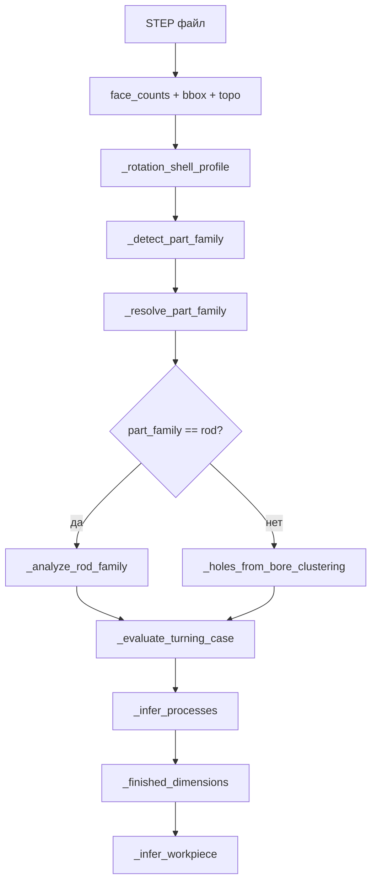

# Семейство детали и заготовка (STEP)

Версия: **2026-06-22**  
Код: `extraction_tool/extractor.py`, `extraction_tool/config.py`  
Обёртка: `step_analyzer.analyze_step()` → `project_store.persist_step_analysis()` → `data.txt`

Связанные документы:

- [TZ-turning-rotation-classification.md](TZ-turning-rotation-classification.md) — история внедрения `rotation_confidence` и отсечения ложной токарки (кейс FRM.698)
- [TZ-costing-drawing-criteria.md](TZ-costing-drawing-criteria.md) — критерии из чертежа (Ra, резьба, паз), **не** подменяют семейство STEP

---

## 1. Зачем это нужно

Из STEP автоматически определяются:

| Результат | Поле в `data.txt` | Влияние |
|-----------|-------------------|---------|
| Семейство детали | `part_family`, `part_type` | Маршрут, prior тонкостенности, UI |
| Технологические процессы | `operations`, `operation_type` | Калькулятор, экспертный промпт |
| Заготовка | `workpiece`, `workpiece_type` (UI) | Припуск, масса материала, форма в калькуляторе |
| Профиль вращения | `rotation_confidence`, `rotation_profile` | Токарка да/нет, `turning_case` |
| Наружные ступени / отверстия | `shafts`, `holes`, `rod_features` | Сверление, вторичные операции |

**Принцип:** семейство и заготовка считаются **только из геометрии STEP**. Текст чертежа («Пруток ДКРНТ 65…») может использоваться в промпте LLM и в критериях стоимости, но не перезаписывает `part_family` без отдельной доработки.

---

## 2. Пайплайн `extract_step_path`



Порядок важен:

1. **`rotation_shell_profile`** — метрики outer/bore до выбора семейства (используется в `_detect_part_family` как подсказка).
2. **`part_family`** — `_detect_part_family` → `_resolve_part_family`.
3. **`rod_meta`** — полный разбор прутка (`_analyze_rod_family`) только если **`part_family == "rod"`** после resolve.
4. **`turning_case`** — `_evaluate_turning_case` с учётом семейства и профиля.
5. **`operations`** — `_infer_processes` (токарная / 3-ось / 5-ось / сверление).
6. **`workpiece`** — `_infer_workpiece` по формату чистовой модели, процессам и `turning_case`.

---

## 3. Семейства детали (`part_family`)

### 3.1. Коды и подписи в UI

| Код | UI (`part_type`) | Смысл |
|-----|------------------|-------|
| `rod` | Пруток | Вал, гильза, диск из проката (Ø ≤ 300 мм) |
| `impeller` | Крыльчатка | Лопаточное колесо, компрессор |
| `plate` | Плита | Плита, корпус, призматическая деталь |
| `oversize` | Крупногабаритная деталь | max(AABB) > 400 мм или масса > 100 кг |
| `hybrid_shaft` | Вал-корпус (гибрид) | Длинный вал с прямоугольным сечением + фрезер |

### 3.2. `_detect_part_family` — порядок проверок

1. **Плита** — коробчатый AABB (`box_like` + доля PLANE ≥ 35%) без круглого сечения; или `_is_flat_plate_bbox`.
2. **Крыльчатка** — `_is_impeller_family` (см. §3.3).
3. **Пруток** — эвристики по AABB (`cross_round`, `is_elongated_rod`), `rotation_confidence`, доле CYL, профилю вращения.
4. **Гибрид** — `_is_hybrid_turn_mill_body` (вал намотки: длинное тело, прямоугольное сечение, много PLANE+CYL).
5. Иначе — **`plate`**.

### 3.3. Крыльчатка vs гильза (TORUS-галтели)

**Проблема (до 2026-06-22):** гильза свечи зажигания с ~30 TORUS-гранями (галтели) ошибочно становилась `impeller`, терялась токарка и заготовка «Пруток».

**Правило `_is_impeller_family` (актуальное):**

- Крыльчатка требует **сплайновых лопаток** (`other_face_count` / BSPL), а не одних тороидов.
- **Не impeller**, если:
  - вытянутое тело вращения (`is_elongated_rod`) + доля CYL ≥ 12% + BSPL < 40 (галтели на прутке);
  - доля PLANE ≥ 38% (корпус с рёбрами);
  - нет `curved_blade_evidence` (BSPL ≥ 55, или torus+bspl в комбинации с порогами по bspl).
- TORUS ≥ 15 **без** BSPL **не** достаточен для impeller.

**Правило `_resolve_part_family`:**

- Если base = `impeller`, но **гильза/пруток**: `is_elongated_rod` + `cyl_share ≥ 0.12` + `bspl < 40` → принудительно **`rod`**.
- Для остальных base: `cross_round` + Ø ≤ `BAR_STOCK_MAX_D_MM` (300) → **`rod`**.

Эталон: `tests/test_sleeve_gilza_classify.py`, проект `МФСУ.387441.001-01_Гильза_свечи_зажигания`.

### 3.4. Крупногабарит (`oversize`)

`is_oversize_part`: max(AABB) > **400 мм** или масса по объёму STEP > **100 кг** (плотность по умолчанию 7.85 г/см³).

Перекрывает base-семейство, но **не отменяет** токарку при высоком `rotation_confidence` (поковка, Case B).

---

## 4. Профиль вращения и токарка

### 4.1. `rotation_confidence` (`rot_conf`)

Считается в `_rotation_shell_profile` по цилиндрам с классификацией **outer / bore / ambiguous** (`_cylindrical_shell_kind`):

| Метрика | Описание |
|---------|----------|
| `outer_cyl_area_share` | Доля площади наружных цилиндров |
| `bore_cyl_area_share` | Доля площади отверстий |
| `main_axis_coaxiality` | Доля цилиндров с осью ≈ главной (≤ 8°) |
| `outer_diameter_span` | Разброс Ø наружных ступеней |
| `plane_penalty` | Штраф за боковые плоскости корпуса |
| `outer_diameter_mm`, `ld_ratio` | Ø и L/D для токарного кейса |

AABB `cross_round` — **вспомогательный** признак, недостаточен сам по себе (см. FRM.698).

### 4.2. Пороги (`extraction_tool/config.py`)

| Константа | Значение | Назначение |
|-----------|----------|------------|
| `BAR_STOCK_MAX_D_MM` | 300 | Макс. Ø прутка из проката |
| `ROD_MIN_LD_RATIO` | 1.8 | Мин. L/D для прутка |
| `ROT_CONF_MIN_TURN` | 0.60 | Ниже — токарка не назначается |
| `ROT_CONF_BAR` | 0.75 | Классический пруток (Case A) |
| `ROT_CONF_FORGING` | 0.90 | Крупная поковка (Case B) |
| `ROT_CONF_DISC` | 0.80 | Диск / фланец (Case C) |
| `ROT_CONF_HYBRID` | 0.55 | Гибрид токарка+фреза (Case D) |

### 4.3. `turning_case` (`_evaluate_turning_case`)

| Значение | Условия (упрощённо) | `rotational` |
|----------|---------------------|--------------|
| `bar` | `part_family=rod`, Ø ≤ 300, L/D ≥ 1.8 или elongated rod; сниженные пороги `rot_conf` для elongated rod | true |
| `forging` | Ø > 300, `rot_conf ≥ 0.90`, высокая доля outer | true |
| `disc` | `is_disc` или короткий цилиндр с высокой долей outer | true |
| `hybrid` | `_is_hybrid_turn_mill_body` или ключевые слова «намотк» в имени файла | true |
| `null` | `rot_conf < 0.60` и не hybrid | false |

Поле `turning_skip_reason` — текст для отладки (UI/логи).

**Связь с процессами:** «Токарная» попадает в `operations`, только если `rotation_profile.rotational == true` (или hybrid с достаточным `rot_conf`).

---

## 5. Заготовка (`workpiece`)

Функция `_infer_workpiece(finished, processes, rot_profile, part_family)`.

| `workpiece.type` | Условие |
|------------------|---------|
| **Пруток** | `finished.format == "rod"` и (`turning_case` ∈ bar/disc/hybrid/null) и Ø ≤ 300; **или** «Токарная» в processes и `turning_case == "bar"` |
| **Поковка** | `turning_case == "forging"` или токарка при Ø > 300 |
| **Плита** | По умолчанию для `plate`, impeller без токарки |
| **Блок** | `part_family == "oversize"` без цилиндрической заготовки |

Размеры:

- **Пруток:** `diameter`, `length` из `_finished_dimensions` (главные оси инерции, уточнение Ø по `shafts`).
- **Плита / блок:** `width`, `length`, `height` — габариты параллелепипеда.

Припуск к заготовке в калькуляторе: `utils._apply_allowance` / `machining_cost.blank_dimensions` — отдельно от STEP-классификации.

### 5.1. `finished_dimensions.format`

| `format` | Когда |
|----------|-------|
| `rod` | Токарная в processes или `part_family=rod` с подходящей геометрией |
| `box` | Плита, корпус, oversize без токарного формата |

**Важно:** не должно быть противоречия `workpiece=Плита` + `format=rod` без поковки/токарного кейса.

---

## 6. Процессы (`operations`)

`_infer_processes` формирует список (порядок сохраняется):

1. **Токарная** — если `rotational` из `rotation_profile`.
2. **Фрезерная (5-осевая)** — `_needs_5axis_milling` (impeller, много TORUS/BSPL, высокий `detail_index`; для плоской плиты — более жёсткие пороги).
3. **Фрезерная** (3-ось) — карманы, плоскости, hybrid, отверстия с боков.
4. **Сверление** — по числу отверстий / вторичным признакам на прутке.

Для **`part_family == "rod"`** вызывается `_analyze_rod_family`:

- **shafts** — наружные ступени (outer CYL);
- **holes** — bore-цилиндры, болты, глухие отверстия;
- **rod_features** — шпон. паз, M6, кластеры болтов (технологические флаги).

---

## 7. Отверстия: пороги

| Контекст | Мин. Ø | Файл |
|----------|--------|------|
| Плита (`_holes_from_bore_clustering`) | 5.5 мм (`MIN_HOLE_DIAMETER_MM`) | `config.py` |
| Пруток (`_analyze_rod_family`) | bore ≥ 4.5 мм при достаточной площади грани | `extractor.py` |

Мелкие отверстия (например 13×Ø4,5 на гильзе) видны в rod-разборе, но могут не агрегироваться в отдельный счётчик «N мест» — зона доработки.

---

## 8. Чертёж vs STEP

| Аспект | STEP | Чертёж |
|--------|------|--------|
| Семейство, заготовка, токарка | ✅ | ❌ (не перезаписывает) |
| Ra, допуски, резьба, паз | ❌ | ✅ `drawing_manufacturing_criteria` |
| Модификаторы стоимости | база | поверх базы |

**Keyway:** с 2026-06-22 шпоночный паз ищется **только в тексте чертежа** (`drawing_text`), без текста LLM — иначе слово «пазов» в экспертном ответе давало ложный `keyway`.

**Резьба:** regex поддерживает `M18х1,5`, `M12x1.5` (лат./кир. `x`, `×`); OCR может не распознать M12 на сложных листах.

---

## 9. Поля JSON (отладка)

```json
{
  "part_family": "rod",
  "part_type_hint": "Пруток",
  "operations": ["Токарная", "Фрезерная (5-осевая)"],
  "workpiece": {"type": "Пруток", "diameter": 56.4, "length": 145.0},
  "rotation_confidence": 0.724,
  "rotation_profile": {
    "outer_cyl_area_share": 0.527,
    "bore_cyl_area_share": 0.473,
    "main_axis_coaxiality": 0.989,
    "rotational": true,
    "turning_case": "bar",
    "turning_skip_reason": null,
    "outer_diameter_mm": 59.5,
    "ld_ratio": 2.44
  },
  "shafts": [{"diameter": 59.5, "feature": "body"}],
  "holes": [{"diameter": 4.5, "feature": "bore"}]
}
```

---

## 10. Тесты

| Файл | Что проверяет |
|------|----------------|
| `tests/test_sleeve_gilza_classify.py` | Гильза: не impeller, rod, токарка |
| `tests/test_wall_thickness_gate.py` | impeller не downgrade; prior семейства |
| `tests/test_hybrid_shaft_detect.py` | Гибридный вал намотки |
| `tests/test_disc_rod_diameter.py` | Ø диска по bbox |
| `tests/test_manufacturing_criteria.py` | Резьба M18/M12, keyway без LLM |

Запуск:

```bash
/opt/sinlex/.conda/envs/sinlex/bin/python -m unittest \
  tests.test_sleeve_gilza_classify \
  tests.test_manufacturing_criteria \
  tests.test_wall_thickness_gate \
  tests.test_disc_rod_diameter -v
```

---

## 11. Эталонные кейсы

| Деталь | Ожидание |
|--------|----------|
| FRM.698 Корзина | `oversize`, без «Токарная», `rot_conf < 0.60` |
| МФСУ.387441.001-01 Гильза | `rod`, «Пруток», «Токарная», `turning_case=bar` |
| Колесо компрессора | `impeller`, 5-ось, без ложной токарки |
| Вал намотки | `hybrid` / oversize + hybrid_turn_mill, токарка + фреза |
| Плоская плита | `plate`, «Плита», без токарки |
| STUD.122 Стойка M3 шестигр. | `rod`, `hex_head_stud`, «Токарная» + «Фрезерная» (только г-head), пруток |

---

## 12. История изменений

| Дата | Изменение |
|------|-----------|
| 2026-06-02 | `rotation_confidence`, outer/bore, кейсы bar/forging/disc — см. TZ-turning |
| 2026-06-22 | Гильза: TORUS ≠ impeller; resolve impeller→rod; keyway/резьба из чертежа; коммит `0011656` |
| 2026-06-22 | **STUD.122 / шпильки с шестигранником:** `_is_hex_head_stud` в `extractor.py` — токарка тела+резьбы при `rotation_confidence≈0`; флаг `hex_head_stud` в geometry/data.txt. **Калькуляция:** `machining_cost.py` — раздельное резание (токарка + шестигр. + резьба); `cam_rate=0` не подменяется DEFAULT; UI `_format_hours_h` — субминутное время не округляется до 0. Тесты: `test_hex_stud_classify`, `test_hex_stud_cutting`, `test_format_hours_subminute`, `test_cam_rate_zero_with_criteria`. Коммит `f783bfd`. |
