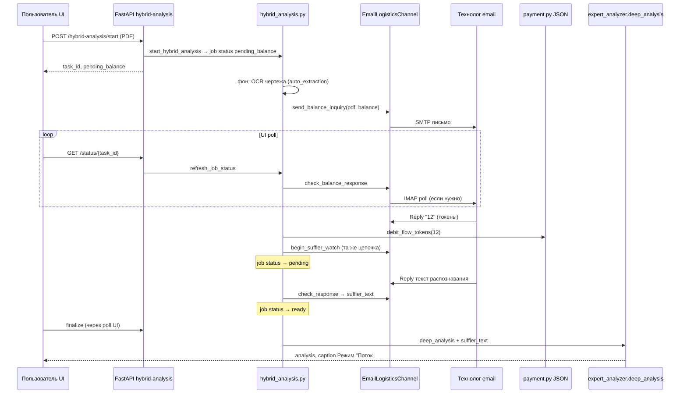

# Мануал «Поток»

Версия: **2026-05-25** (фактическая реализация на сервере `/opt/sinlex`)  
Аудитория: разработчики, сопровождение, технолог (протокол email)

Связанные ТЗ (история и детали):

| Документ | Зачем читать |
|----------|----------------|
| [`TZ-flow-tokens-payment.md`](TZ-flow-tokens-payment.md) | Баланс, ЮKassa, `payment.py`, топбар «Баланс» (§0) |
| [`TZ-hybrid-deep-analysis.md`](TZ-hybrid-deep-analysis.md) | Гибридный анализ, job-файлы, finalize |
| [`TZ-hybrid-email-logistics.md`](TZ-hybrid-email-logistics.md) | SMTP/IMAP, ящик технологов |
| [`TZ-llm-provider-priority.md`](TZ-llm-provider-priority.md) | LLM в classic vs hybrid (Perplexity в hybrid) |

---

## 1. Что такое «Поток»

**Поток** — углублённый анализ чертежа через гибридный канал (email или MAX):

1. Пользователь загружает PDF и нажимает кнопку **«Поток»** в UI.
2. Система отправляет технологу **одно письмо**: служебная информация (баланс токенов) **+ PDF чертежа**.
3. Технолог отвечает **числом токенов** к списанию (или `0` = отказ).
4. Система списывает токены с JSON-профиля пользователя.
5. Технолог присылает **второй ответ** в той же цепочке — текст распознавания (суфлёр).
6. Backend вызывает `deep_analysis` (нейросеть) и показывает результат с подписью **Режим "Поток"**.

**1 токен = 10 ₽.** Пополнение — глобальный виджет **🌀 Баланс** (`page_shell.py`), не только страница «Тарифы».

---

## 2. Что сделано в сессии 2026-05-25 (кратко)

| Было | Стало |
|------|--------|
| Оценка трудоёмкости **Perplexity после** анализа | Списание **до** нейроанализа, по **ответу технолога** в email |
| Отдельное письмо «только баланс», потом письмо с чертежом | **Одно** письмо: баланс + PDF |
| Блокировка старта при нулевом балансе (402) | Старт разрешён; `0` в ответе → остановка с сообщением в UI |
| Подпись «Углублённый режим» | **Режим "Поток"** |
| Expander «Чертёж vs модель» | **Удалён** из UI и из рабочего пайплайна |
| Бегунок «Определение стоимости…» | **Идет анализ** → **Списано N токен(ов). Идет анализ...** → **Подготовка результатов нейросетевого анализа...** |

---

## 3. Сквозной сценарий (как работает)



### 3.1. Статусы job (`hybrid_jobs/{task_id}.json`)

| Статус | Смысл |
|--------|--------|
| `pending_balance` | Ждём **первый** ответ email: число токенов (чертёж уже отправлен) |
| `pending` | Токены списаны; ждём **второй** ответ: текст суфлёра |
| `preparing` | Только **UI** (session): суфлёр получен, идёт `finalize` / LLM |
| `ready` | Суфлёр в job; можно finalize |
| `error` | В т.ч. `insufficient_tokens` → UI: «Недостаточно токенов, пополните баланс» |
| `timeout` / `cancelled` | Как раньше |

Файл job: `{projects_base}/{user_folder}/{project}/hybrid_jobs/{uuid}.json`

---

## 4. Email-протокол (канал `email_logistics`)

Активный канал: `config/hybrid_channel.json` → `"active_channel": "email_logistics"`.

### 4.1. Исходящее письмо (одно на задачу)

- **Функция:** `email_logistics/smtp_send.py` → `send_balance_inquiry_email()`
- **Тело:** `hybrid_channel/markers.py` → `build_balance_inquiry_body()`
- **Маркер:** `#sinlex-flow-balance`
- **Поля в теле:** `task_id`, `balance_tokens`, `user_email`, `user_folder`, `project`
- **Вложение:** `drawing.pdf`

Технологу: ответить **одним числом** в Reply (`12`, `0`, или `tokens: 12`).

### 4.2. Первый ответ (токены)

- **IMAP:** `email_logistics/imap_receive.py` → `poll_balance_inbox()`
- **Состояние:** `data/email_logistics_state.json`
  - `balance_pending` — ожидание ответа
  - `balance_responses` — `{task_id: число}`
  - `inquiry_meta` — `message_id` цепочки для суфлёра
- **Разбор числа:** `markers.parse_balance_tokens_from_text()`  
  Длинный текст анализа **не** парсится как токены (защита от ложных срабатываний).

### 4.3. После списания — второй ответ (суфлёр)

- **Не отправляется** второе письмо с PDF.
- `EmailLogisticsChannel.begin_suffler_watch()` регистрирует `pending` с тем же `message_id`.
- **IMAP:** `poll_inbox()` → `responses[task_id]` = текст для `parse_hybrid_response()`.

### 4.4. Состояние канала (файл)

По умолчанию: `/opt/sinlex/data/email_logistics_state.json`  
Переменная: `EMAIL_LOGISTICS_STATE_FILE`

---

## 5. Биллинг токенов

| Операция | Модуль | Когда |
|----------|--------|--------|
| Баланс | `payment.get_flow_token_balance(email)` | В письмо технологу; топбар UI |
| Списание | `payment.debit_flow_tokens(..., source="flow_analysis", task_id=...)` | После ответа > 0, **до** ожидания суфлёра |
| Пополнение | `credit_flow_tokens` + ЮKassa `purpose=flow_tokens` | Топбар / Тарифы |
| Legacy очередь | `data/flow_pending/{folder}.json` | Старые job, где анализ готов, а денег не хватало |

Профиль пользователя: `data/user_payments/{folder}.json` (folder из `accounts.json`, не slug email).

**Убрано:** `flow_billing.estimate_flow_tokens()` (Perplexity `sonar-reasoning-pro` после анализа).  
`flow_billing.py` оставлен только для **legacy** `pending_payment` по старым задачам.

---

## 6. UI (Streamlit)

Основной файл: **`page_modules/pdf_analysis.py`**

| Элемент | Реализация |
|---------|------------|
| Кнопка «Поток» | `render_drawing_action_buttons()` → `_start_hybrid_analysis_ui()` |
| Старт | `POST {NGROK_URL}/hybrid-analysis/start` — **без** 402 по нулевому балансу |
| Опрос | `_hybrid_poll_fragment` → `_tick_hybrid_poll()` каждые N сек |
| Бегунок | `st.status(_hybrid_spinner_label(...))` |

### 6.1. Тексты бегунка

| Фаза | Session `hybrid_status_*` | Текст |
|------|---------------------------|--------|
| До ответа по токенам | `pending_balance` | **Идет анализ** |
| После списания | `pending` + `hybrid_tokens_charged_{slug}` | **Списано 12 токенов. Идет анализ...** (склонение в `_flow_tokens_debited_label`) |
| Суфлёр получен, идёт LLM | `preparing` | **Подготовка результатов нейросетевого анализа конструкторской документации...** |
| Готово | `ready` / `done` | Результат + `st.caption('Режим "Поток"')` |

### 6.2. Глобальный баланс

- `page_shell.py` — `render_app_flow_balance_bar()`, `fetch_flow_balance()`, dialog пополнения
- `app.py` — вызов топбара после сайдбара

---

## 7. API (FastAPI)

Роутер: **`api/routers/hybrid_analysis.py`**

| Метод | Путь | Назначение |
|-------|------|------------|
| POST | `/hybrid-analysis/start` | Создать job, фон `run_start_background` |
| GET | `/hybrid-analysis/status/{task_id}` | `refresh_job_status` → публичные поля job |
| POST | `/hybrid-analysis/finalize/{task_id}` | `deep_analysis` при `status=ready` |

Платежи: **`api/routers/payments.py`**

- `GET /payments/flow-balance`
- `POST /payments/flow-topup`
- `POST /payments/flow-pending/release`

---

## 8. Карта файлов и связей

```text
app.py
  └─ page_shell.render_app_flow_balance_bar()
  └─ pages → pdf_analysis (кнопка Поток)

page_modules/pdf_analysis.py          ← UI, poll, бегунок, результат
  ├─ hybrid_analysis (через HTTP NGROK_URL)
  └─ payment (release pending, legacy)

api/routers/hybrid_analysis.py        ← REST
  └─ hybrid_analysis.py               ← оркестратор job
       ├─ drawing_analysis.reader     ← auto_extraction (OCR)
       ├─ email_logistics.get_hybrid_channel()
       ├─ payment.debit_flow_tokens / get_flow_token_balance
       └─ expert_analyzer.deep_analysis (finalize)

email_logistics/__init__.py           ← фасад канала
  ├─ channel.py                       ← EmailLogisticsChannel
  ├─ smtp_send.py                     ← send_balance_inquiry_email (+ PDF)
  ├─ imap_receive.py                  ← poll_balance_inbox, poll_inbox
  └─ config.py                        ← secrets, state path

hybrid_channel/markers.py             ← #sinlex-flow-balance, parse tokens
hybrid_channel/parse.py               ← parse_hybrid_response (суфлёр)

max_suffler.py                        ← альтернатива MAX (авто 1 токен если balance>0)

payment.py                            ← баланс, debit/credit, flow_pending
flow_billing.py                       ← legacy pending_payment только

expert_analyzer.py                    ← deep_analysis (hybrid = Perplexity + suffler)

config/hybrid_channel.json            ← active_channel
data/email_logistics_state.json       ← pending / balance / responses
data/user_payments/{folder}.json      ← flow_tokens
projects/.../hybrid_jobs/*.json       ← job state
```

### 8.1. Ключевые функции (куда смотреть при отладке)

| Симптом | Смотреть |
|---------|----------|
| Письмо не ушло | `smtp_send.send_balance_inquiry_email`, лог `email_logistics.smtp` |
| Не видит ответ с числом | `imap_receive.poll_balance_inbox`, `markers.parse_balance_tokens_from_text`, `email_logistics_state.json` |
| Не списались токены | `hybrid_analysis._advance_after_balance_inquiry`, `payment.debit_flow_tokens` |
| Не пришёл суфлёр | `begin_suffler_watch`, `poll_inbox`, `pending` в state |
| Завис бегунок на «Идет анализ» | `GET /status`, job `status`, IMAP UNSEEN |
| Ошибка «Недостаточно токенов» | ответ `0` или debit failed |
| LLM не отвечает | `finalize_hybrid_job`, `expert_analyzer`, кеш `analysis_cache/` |

---

## 9. Канал MAX (`max_suffler`)

Если в `hybrid_channel.json` включён `max_suffler`:

- `send_balance_inquiry` отправляет PDF + текст баланса в чат MAX.
- `check_balance_response` **сразу** возвращает `1` при balance > 0, иначе `0` (без участия человека).
- Дальше тот же `begin_suffler_watch` / `check_response`.

Для продакшена сейчас активен **email_logistics**.

---

## 10. Тесты

| Файл | Что проверяет |
|------|----------------|
| `tests/test_hybrid_analysis.py` | job store, pending_balance, mock канала |
| `tests/test_flow_tokens_payment.py` | credit/debit, FIFO pending |
| `tests/test_drawing_compare.py` | модуль compare (в прод-потоке **не используется**) |

Запуск:

```bash
cd /opt/sinlex
sudo -u sinlex python3 -m unittest tests.test_hybrid_analysis tests.test_flow_tokens_payment -q
```

---

## 11. Операции

Перезапуск после правок:

```bash
sudo systemctl restart sinlex-server sinlex-streamlit
```

Проверка:

```bash
systemctl is-active sinlex-server sinlex-streamlit
```

Логи: journalctl / файлы приложения по настройке деплоя.

---

## 12. Что намеренно убрано (не восстанавливать без ТЗ)

- **Perplexity-биллинг** после анализа (`estimate_flow_tokens`, `run_flow_billing_gate` с LLM).
- **402** на `/hybrid-analysis/start` при нулевом балансе.
- **Повторная** отправка PDF после ответа по токенам (чертёж только в первом письме).
- UI **«Чертёж vs модель»** и `auto_compare` / `drawing_compare` в гибридном и expert-потоке.
- Подпись **«Углублённый режим»** в результате.

---

## 13. Чеклист для технолога (email)

1. Получить письмо `[Sinlex] Поток — стоимость анализа — {проект}` с PDF.
2. **Reply** одной строкой: число токенов (`15`) или `0`.
3. **Reply** в той же цепочке: текст распознавания чертежа (как раньше для суфлёра).

При `0` пользователь увидит: **Недостаточно токенов, пополните баланс**.

---

*Документ отражает код на 2026-05-25. При расхождении с `TZ-flow-tokens-payment.md` (старые этапы 2–7 с Perplexity) приоритет у этого мануала и фактического кода.*
